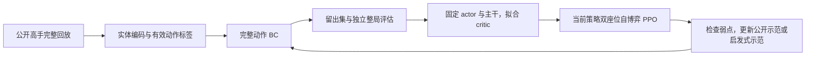

# 本项目完整动作 BC pipeline

实现与配置都在本仓库：`src/route_rl/action_bc.py`、`replay_download.py`、`replay_prepare.py` 和 `src/route_rl/full_action/`。`kaggriculture-solution/` 只作为阅读参考，保持 git ignore；安装、下载、预处理、初始化、训练和评估均不导入或运行其中的文件，也不需要它存在。

借鉴其公开回放起步顺序、实体 Transformer、动作词表、有效动作标签与 BC 损失，将当前 BC 必需组件整合为 `route_rl.full_action`，由本项目维护。来源及具体适配见 [来源记录](action_bc_sources.md)。本次没有导入参考的 PPO、启发式教师、搜索器、CUDA 自定义 kernel 或模型权重。完整动作 BC 是本项目独立候选分支，原生 event pipeline 保留。

## 他们实际采用的顺序

来自 [训练谱系](https://github.com/msdsm/kaggriculture-solution/blob/84057a0fda4238ccdebc46f9bf5496c6c4b2e00d/docs/training-lineage.md)：

| 阶段 | 教师来源 | 轨迹数 | BC 遍数 |
| --- | --- | ---: | ---: |
| BC 1 | 去重后的 34 个公开提交 | 4,459，来自 3,806 局 | 30 |
| BC 2 | 刷新的公开前 20 名提交 | 4,560 | 10 |
| BC 3 | 早期启发式／搜索教师 | 89 | 1 |
| BC 4 | 两个公开教师 | 352 | 3 |
| BC 5 | 公开教师＋针对弱点生成的启发式自博弈 | 849＋600 | 2 |

这些 BC 阶段之间穿插 PPO。轨迹指一个教师座位的完整行动记录，一局可以贡献两条。先公开回放，后期启发式补课；不是仅用赢家，也不是从启发式教师起步。



本次交付到 BC 及其评估入口。critic 拟合是他们最后一次 BC 后采用的步骤，不是已证实每轮历史 BC 都做过。PPO 和补课阶段留作后续，不自动启动。

## 为什么独立接入

已读 [比赛回放复盘](competition_replay_review.md)、[plan compare 复盘](plan_compare_trial_review.md)、[当前计划设计](event_plan_next_steps.md)、[最终学习审计](contextual_learning_final_audit.md)，并核对 `runs/cpu_smoke_01`。

- 当前运行是 event-v12：第 1 轮未晋级，accepted revision 仍为 0；这是连通性样本，不是新策略改善的证据。
- 当前底座已有批量生产、经济路线和两阶段衔接。旧 mixed 每天两个项目的限制不能用来解释当前失败。
- 最终审计发现有效候选存在、标签和梯度通路正常，但网络没有可靠选中改进；信息、函数表达、优化或标签噪声的原因仍未唯一确定。
- 本次补的具体能力是：对完整教师状态序列反复训练单位和市场动作策略。BC 不用 critic 估值给教师动作降权；不同于旧每轮末尾的小批自我模仿。

DECEM 的连续生产、条件续种／转产、共享材料工作路线及现金周转，是行为检查维度。完整动作标签能表示这些行为，能否实际学会需要回放和整局验证。没有由 DECEM 回放推断其训练算法，也没有把某局配方写成正确答案。

现有 event 模型、已接受策略及 checkpoints 不变。新的 `.pkl` 动作模型不能接续原生 event 的 `.json` 权重或优化器。评估输出始终标记 `candidate_only`，不会覆盖部署或晋级模型。

## 先下载数据

clone 的 [数据说明](https://github.com/msdsm/kaggriculture-solution/blob/84057a0fda4238ccdebc46f9bf5496c6c4b2e00d/docs/data.md) 明确要求用户提供已下载回放；不含历史数据或下载器。不能声称知道他们未公开的历史下载脚本。我们补的是官方 Kaggle 客户端下载入口。

官方依据：[认证](https://github.com/Kaggle/kaggle-cli/blob/main/docs/README.md#authentication)、[模拟竞赛下载教程](https://github.com/Kaggle/kaggle-cli/blob/main/docs/simulation_competitions.md)。`competitions download kaggriculture` 下载比赛文件，不是高手的比赛回放。

从仓库根目录执行，下载工具先用独立环境，不安装 JAX：

可以先只运行这个封装命令：

```bash
bash tools/download_public_bc.sh data/action_bc 20 5
```

它创建独立下载环境、调用官方浏览器登录、冻结 20 个教师并每个下载最多 5 局。重复运行复用教师快照和已下载回放；第三个参数可扩大每个教师的局数。自动读取的是当前排行榜，不能复原对方未公开的全部历史教师清单。

分步命令如下：

```bash
python -m venv .venv-bc-tools
.venv-bc-tools/bin/python -m pip install 'kaggle==2.2.4'
.venv-bc-tools/bin/kaggle auth login --no-launch-browser
```

登录命令会给出浏览器授权地址。认证由 Kaggle 客户端保存在本机，不需要把密钥放进教师清单或聊天。若账户没有比赛访问权限，先在 Kaggle 网站加入比赛。

先冻结当前前 20 支队伍的教师快照，每队取公开分数最高的一个活跃提交：

```bash
PYTHONPATH=src .venv-bc-tools/bin/python -m route_rl.replay_download discover \
  --top-teams 20 --out data/action_bc/teachers.json

PYTHONPATH=src .venv-bc-tools/bin/python -m route_rl.replay_download download \
  --teachers data/action_bc/teachers.json \
  --out data/action_bc/public --limit-per-teacher 5
```

5 局／教师用于先检查下载和准备链路，最多约 100 局；不是他们的完整训练数据规模。确认数据后，同目录重复命令，把数量提高到例如 100，已下载文件会复用。样本按固定 episode 哈希排序，保留正常完成的胜、平、负，不按终局现金挑选。按用户要求排除 `seed=0` 的开头自博弈对局：读取真实 `configuration.seed` 或 `info.seed` 后跳过，跳过的局不占下载额度，继续尝试其他对局。已确认的零种子 episode ID 保存在 `skipped.jsonl`，续下载不重复请求这些回放。缺失 seed 不当作 0。下载额度按每个教师的独立局数计，不按座位轨迹计。

`bash tools/download_public_bc.sh data/action_bc 20 100` 会先原地清理旧索引里的零种子对局，再执行下载；直接使用 Python 下载入口也会清理，并自动过滤新遇到的零种子对局。原索引路径仍是 `data/action_bc/public/teacher-seats.jsonl`。清理会保留带校验值的原索引备份、原始 replay 文件，并更新已有下载 receipt 的计数和索引校验值。

当前前 20 队并非他们当年的同一组教师。历史 34 个提交的完整 ID 清单不在公开 release 中。`discover` 将队伍名、公开分数和 submission ID 保存下来供检查，也可以手工创建这样的显式教师清单：

```json
{"competition":"kaggriculture","teachers":[{"submission_id":12345678}]}
```

这里的数字只是格式示例，需替换为实际公开提交 ID。官方手动查询方式：

```bash
kaggle competitions leaderboard kaggriculture -s
kaggle competitions team-submissions TEAM_ID
kaggle competitions episodes SUBMISSION_ID
kaggle competitions replay EPISODE_ID -p data/manual_replays
```

自动下载入口从官方 `episode.agents` 的 `submission_id` 和 `index` 确认教师座位；既不猜赢家，也不假设教师永远是座位 0。只接收已核对规则的版本 1.32.7／1.33.0、720 个状态、双方正常结束、包含双方完整观察及动作的回放。异常／超时和未核对版本会跳过，原因写入 `skipped.jsonl`，不会静默改写版本。API 无权限时明确停止；限流或暂时服务错误有限重试。

输出 `public/teacher-seats.jsonl` 一行一个教师座位，记录 replay 校验值。重复运行去重；同一对局两个教师会共享回放文件，但保留两个座位。历史旧版本若大量被过滤，需要选择兼容的提交或另外实现经验证的版本适配，不能只改 `module_version`。

### 按 submission ID 直接批量下载

`submissionId` 是一份策略提交，`episodeId` 是它参加的一场比赛。同一提交对应许多对局，下载器自动列举这些对局，不需要手工复制每个 episode ID：

```bash
PYTHONPATH=src .venv-bc-tools/bin/python -m route_rl.replay_download download \
  --submission 56722220 --limit-per-teacher 100 \
  --out data/action_bc/submission-56722220
```

可重复 `--submission` 下载多位教师；同一输出目录重复执行会复用已下载回放。输入教师清单和直接输入 ID 二选一；已有前 20 名清单可以继续用之前的 `--teachers` 命令。

首次真实下载暴露并修复了三个问题：

- API 对局为 `COMPLETED`，但选手状态省略后成为 SDK 的 `UNSPECIFIED`。现在允许下载这种候选，再由回放最终状态确认双方正常完成；显式超时、失败或等待仍排除。日志增加列出局数和元数据过滤原因。
- 当前真实回放标记 `1.33.0`。从官方 PyPI wheel 提取比较后，`1.32.7` 与 `1.33.0` 的所有六个 Kaggriculture 文件完全一致，包括规则 `.py` 和配置 `.json`。规则 SHA256 为 `bc8a54879ef02c7ea64b8b333d6a976f0ea65c4949149d01f463f23bccee653e`，配置 SHA256 为 `a82c89c1a2315b93f39775d8e025471a01b738647c9772658368ee6b1b6f4867`。只接受这两个已核对版本，保留原始 `module_version`；预处理时还检查安装的 1.32.7 规则文件哈希。
- 真实座位 1 的观察没有 `step`，但有实际 `day/hour`，与对方编码器已有的时间读取方式一致。检查用 `day*24+hour`，不修改原始观察。公开 replay 的实际 seed 位于 `info.seed`，也纳入训练／验证隔离检查。

兼容逻辑位于 `src/route_rl/replay_rules.py`，数据契约为 `public-full-action-bc-v3`。旧 v1/v2 缓存和 run 不静默续用，需要新准备目录；已下载的原始回放可以直接复用。新的 policy 带 `route-rl-full-action-policy-v1` 契约，不能直接续用旧包装器的 checkpoint 或原生 event checkpoint。

## 准备与训练 BC

使用 Python 3.12 或更高版本。下面按当前机器的系统 `python` 执行，无需创建 `.venv-bc`。当前 A40 使用本项目的 GPU 依赖；CPU 验证环境可改用 `.[bc]`。等待公开回放下载完成后，再执行准备步骤。

本项目 `full_action/configs/bc.json` 保留参考公开配置：每卡 batch 320、BF16、学习率 `1e-4`、Adam epsilon `1e-5`、梯度裁剪 5、两个熵系数均为 `0.10`、初始策略 KL 系数 `0.05`、随机种子 51，并保存每个 epoch 的策略。公开文件的 `epochs=2` 对应最后阶段。本项目从零起步的下列命令采用六层 bootstrap，并参照历史 BC1 的 **30 个 epoch**；其余设置沿用公开配置。历史 BC1 的完整早期超参数没有公开，不能称为逐项复现。

```bash
python -m pip install -e '.[bc-gpu]'
PYTHONPATH=src python -m route_rl.action_bc doctor

PYTHONPATH=src python -m route_rl.action_bc prepare \
  --index data/action_bc/public/teacher-seats.jsonl \
  --out data/action_bc/prepared_own --workers 16

PYTHONPATH=src python -m route_rl.action_bc init \
  --model bootstrap --out models/action_bc_own_initial.pkl

CUDA_VISIBLE_DEVICES=0 PYTHONPATH=src python -m route_rl.action_bc train \
  --initial models/action_bc_own_initial.pkl \
  --cache data/action_bc/prepared_own/cache \
  --out runs/action_bc_own_public_trial \
  --epochs 30 --batch-size 320 --compute-dtype bfloat16
```

如果安装在 Debian 自带的 `blinker 1.7.0` 上报 `uninstall-no-record-file`，先只对该包跳过旧安装的卸载，再重新执行依赖安装：

```bash
python -m pip install --ignore-installed --no-deps blinker==1.9.0
python -m pip install -e '.[bc-gpu]'
```

当前机器的旧包位于 `/usr/lib/python3/dist-packages`，pip 包安装到 `/usr/local/lib/python3.12/dist-packages`，无需删除 Debian 文件。只对 `blinker` 使用 `--ignore-installed`，不要给整套 BC 依赖加这个选项。安装成功后先确认 JAX 能看到 GPU：

```bash
CUDA_VISIBLE_DEVICES=0 python -c 'import jax; print(jax.devices())'
```

输出应包含 `CudaDevice`，然后继续执行准备、初始化与训练步骤。CUDA 训练需要对应的驱动，安装命令为 `pip install -e '.[bc-gpu]'`；多 GPU 主机先用 `CUDA_VISIBLE_DEVICES=0` 选择一张卡。`doctor` 输出本项目源码指纹与依赖版本，不读取参考目录。当前 BC 入口支持单进程、单设备；分布式启动尚未接入。

`prepare --workers` 只控制读取/解压回放、编码与生成标签的 **CPU 进程数**，不表示 GPU 的训练并行度。参考预处理默认 16 个进程；当前机器可见 96 个 CPU，本命令采用 16。BC 训练将一个 320 样本的 batch 交给一张 A40 计算，不通过这 16 个预处理进程训练。

模型配置属于本项目包内的 `src/route_rl/full_action/configs/`。`bootstrap` 为六层、宽度 256；`10m` 为十二层；`smoke` 为一层、宽度 32，只用于实现检查。采用手写 JAX attention 数值路径；保留同一特征、参数形状及动作语义，未接入对方的实验 kernel 或 Net2Net 工具。三种训练预设均使用从 features 恢复元数据的分组路径，支持 feature-only BC 缓存。

本项目的 `replay_prepare.py` 负责版本核对、教师清单、缓存与规则哈希检查，使用项目内的 `full_action/features.py`、`inventory_tracker.py`、`labels.py` 和 `legality.py`：

- `observation[t] → action[t+1]`，每条完整教师轨迹 719 行。
- 每行 `features[264,124]`：实体与公开信息估计；`labels[30]`：最多 20 个己方单位和 10 个市场槽。
- 教师数据超出 20 个己方单位或 40 个总单位时拒绝编码；推理沿用固定容量截取，超出的己方单位输出 PASS。这是当前模型的容量边界，不代表能学习任意规模的完整农场。
- 官方 1.32.7 执行器过滤无效或未执行标签；SELL 使用实际成交绝对数量。忽略标签为 `-100`。
- 按整局 episode 哈希约 10% 留出，双方座位始终同一 split；无留出或无训练局时明确报错。
- 如果不同 episode 的已知 seed 相同却落入不同 split，会拒绝准备，要求从清单排除冲突对局，避免已知验证 seed 进入训练。
- 用教师此前实际动作推进公开库存估计，与推理时的 tracker 语义衔接。

旧索引可以在原路径剔除全部零种子对局及双方教师座位，不需要换 `--index`：

```bash
PYTHONPATH=src python -m route_rl.replay_download filter-zero-seed \
  --out data/action_bc/public

PYTHONPATH=src python -m route_rl.action_bc prepare \
  --index data/action_bc/public/teacher-seats.jsonl \
  --out data/action_bc/prepared_own --workers 16
```

清理记录保存在 `seed-zero-filter.json`，包括备份文件名、剔除的 episode ID、清理前后校验值和数量。准备入口仍读取原始回放核验种子，拒绝未清理的零种子示范，并保持其他已知种子的训练／验证隔离检查。若非零种子仍跨 split，需要排除其冲突局，不能关闭隔离检查。若此前已有缓存，使用新的准备目录；若在入口检查阶段就退出且没有生成缓存，可继续用原输出路径。

训练前再次检查张量形状、有限特征、动作 ID 范围、去重与 split，计算每个数组的校验值。源码、输入、缓存或训练参数变化时，要求新目录；正常续训只允许增加累计 epoch。新初始文件不能冒充旧 run 的原始初始化。需要重新扩大下载数据时，也使用新的准备目录和训练目录；可将已训练 `.pkl` 作为新 BC 阶段的 `--initial`。

当前项目 BC trainer 将所有轨迹展开到主机 RAM。每条特征张量约 **47 MB**，2,000 条约 **94 GB**，还不包括训练开销。磁盘 `.npz` 的压缩大小不能作为内存需求；本入口输出解压字节数并检查明显的 RAM 不足。先按硬件选教师子集，后续如需大规模数据，应实现流式读取再扩张，而不是直接照搬 4,459 条全部内存加载。

本项目采用的 BC 损失与公开最后阶段配置一致：

```text
CE_unit + CE_market
− 0.10 × H_unit − 0.10 × H_market
+ 0.05 × [KL(initial || current)_unit + KL(initial || current)_market]
```

学习率 `1e-4`、Adam epsilon `1e-5`、梯度裁剪 5，冻结本轮初始策略作为 KL 参考，不训练 value head。以上来自公开最后阶段 `bc.json`，不能说第一轮历史 BC 的全部超参数就是这套。起步命令参照历史第一轮设 `--epochs 30`；若仅按公开最后阶段文件运行，设 `--epochs 2`。30 是历史遍数，不是本项目已验证的最佳值。使用过 batch 16 的 run 不能改成 320 后原目录续训；改变 batch 等训练设置时使用新 run 目录，保留旧产物。

输出：`metrics.jsonl`、`latest_bc_state.pkl`、每个 epoch 的 policy、`final_student_jax.pkl`、本项目 `receipt.json` 和本仓库 `integration.json`。BC 用动作交叉熵监督，不拿现金作为辅助标签或奖励。

## 训练期间验证与整局评估

参考 BC 源码和本项目 trainer 都会在**每个 epoch** 完成训练 pass 后跑完整留出集，输出 unit/market CE、准确率、熵和 teacher KL，写入 `metrics.jsonl`；验证 pass 不更新参数。启用的 `save_epoch_policies=true` 会原子保存 `epoch-1-policy.pkl`、`epoch-2-policy.pkl` 等文件。每 100 个 batch 的训练 loss 日志不是整局评估。

参考公开 BC 循环没有自动插入对手对局；它的整局评估是独立入口。历史上每次手动评估的频率未公开。本项目已经支持 `evaluate --policy` 指定某个 epoch 的策略，**无需等全部 30 个 epoch 训练完**。以下命令在 `epoch-1-policy.pkl` 出现后另开终端执行；评估使用 CPU，不占用正在训练的单张 A40：

```bash
JAX_PLATFORMS=cpu PYTHONPATH=src python -m route_rl.action_bc evaluate \
  --run runs/action_bc_own_public_trial \
  --policy runs/action_bc_own_public_trial/epoch-1-policy.pkl \
  --opponent agents/farm2945_resilient_response/main.py \
  --seed 1600000000 --games 16 \
  --out runs/action_bc_public_eval/epoch-1-farm2945.json
```

后续 epoch 使用对应策略文件与不同的输出路径。固定种子的阶段性比较不能当成多批独立确认；若据此选模型，后续另取未用于选择的种子做独立确认。上述命令手动触发完整对局；当前自动进行的是每个 epoch 的留出验证，尚未实现自动逐 epoch 整局评估调度。

留出集看 unit/market CE 和确定性动作一致率；无操作槽占比高，整体 accuracy 不能代替经营能力。进一步用未见种子交换座位完整运行，观察生产兑现、续种、路线和周转，最终比较终局 match score。

全部训练完成后，也可不指定 `--policy`，默认评估 `final_student_jax.pkl`：

```bash
PYTHONPATH=src python -m route_rl.action_bc evaluate \
  --run runs/action_bc_own_public_trial \
  --opponent agents/farm2945_resilient_response/main.py \
  --seed 1600000000 --games 16 \
  --out runs/action_bc_public_eval/farm2945.json
```

评估使用本项目 `full_action/inference.py` 的 `GreedyPolicy` 和 pinned 官方环境，双方独立进程。特征编码与库存 tracker 复用于训练和推理，单位动作及绝对 SELL 数量沿用同一词表。评估完整 BC 策略，包含 719 次动作及第 720 个终局状态；未接入 Final A 的启发式后处理或季末搜索。多单位与市场协调能否学会仍需整局验证。

已知的示范 seed 与评估 seed 重叠会被拒绝。部分公开 replay 没有原始 seed，报告明确列出无法核查的局数；不能因此声称所有 seed 已完全证明独立。BC 留出始终按 episode 隔离。新策略部署仍应采用训练外的配对初筛与另批独立确认，不因 loss 下降直接覆盖已接受策略；本入口不执行晋级。

后续 PPO 也应在本仓库实现，不能调用参考目录的脚本。计划顺序为：固定 BC actor 与主干、单独拟合 critic → 采集本项目策略的双座位自博弈及真实采样概率 → PPO 更新与能力保持 → 训练外配对初筛与另批独立确认。当前只实现 BC 和候选评估，以上 PPO 环节尚未接入。

后续统一使用当前全动作的观察、词表、tracker 与 checkpoint 契约。终局胜／平／负得分 `1/0.5/0` 作为任务目标；现金与 margin 是诊断。不能把 BC loss 下降、连通性测试通过或借用了相同模型结构说成经营能力已提升。

## 迁移检查

回归测试直接使用本项目模块与已安装的官方规则，不要求参考目录。检查教师座位、`observation[t] → action[t+1]`、实际成交数量、整局 split、续训输入一致性，以及 BC 只更新 actor/主干、保留 value 参数、忽略 padding。项目包的模型配置随安装一起分发。

```bash
PYTHONPATH=src python -m unittest discover -s tests -p test_action_bc.py -v
```

这些检查只证明数据和执行通路一致；正式 BC 训练和独立胜率实验由用户按上述命令运行。
