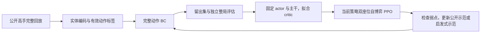

# 完整动作 BC：公开高手回放起步

本次按 `kaggriculture-solution` 的主线接入独立动作学习分支。教师采集、准备、训练和独立评估由本仓库入口编排；实体编码、官方动作执行过滤、Transformer、BC 损失和模型格式直接复用 clone 中的实现，不把高手微动作强行转换成 event 菜单标签。

参考源码：`https://github.com/msdsm/kaggriculture-solution`，接入时 commit 为 `84057a0fda4238ccdebc46f9bf5496c6c4b2e00d`。运行收据会记录实际源码内容哈希。保留这个 checkout；它目前是独立 clone，不随父仓库自动提交或备份。没有复制对方模型权重或训练数据。

## 他们实际采用的顺序

来自 [训练谱系](../kaggriculture-solution/docs/training-lineage.md)：

| 阶段 | 教师来源 | 轨迹数 | BC 遍数 |
| --- | --- | ---: | ---: |
| BC 1 | 去重后的 34 个公开提交 | 4,459，来自 3,806 局 | 30 |
| BC 2 | 刷新的公开前 20 名提交 | 4,560 | 10 |
| BC 3 | 早期启发式／搜索教师 | 89 | 1 |
| BC 4 | 两个公开教师 | 352 | 3 |
| BC 5 | 公开教师＋针对弱点生成的启发式自博弈 | 849＋600 | 2 |

这些 BC 阶段之间穿插 PPO。轨迹指一个教师座位的完整行动记录，一局可以贡献两条。先公开回放，后期启发式补课；不是仅用赢家，也不是从启发式教师起步。



本次交付到 BC 及其评估入口。critic 拟合是他们最后一次 BC 后采用的步骤，不是已证实每轮历史 BC 都做过。PPO 和补课阶段留作后续，不自动启动。

## 为什么独立接入

已读 [比赛回放复盘](competition_replay_review.md)、[plan compare 复盘](plan_compare_trial_review.md)、[当前计划设计](event_plan_next_steps.md)、[最终学习审计](contextual_learning_final_audit.md)，并核对 `runs/cpu_smoke_01`。

- 当前运行是 event-v12：第 1 轮未晋级，accepted revision 仍为 0；这是连通性样本，不是新策略改善的证据。
- 当前底座已有批量生产、经济路线和两阶段衔接。旧 mixed 每天两个项目的限制不能用来解释当前失败。
- 最终审计发现有效候选存在、标签和梯度通路正常，但网络没有可靠选中改进；信息、函数表达、优化或标签噪声的原因仍未唯一确定。
- 本次补的具体能力是：对完整教师状态序列反复训练单位和市场动作策略。BC 不用 critic 估值给教师动作降权；不同于旧每轮末尾的小批自我模仿。

DECEM 的连续生产、条件续种／转产、共享材料工作路线及现金周转，是行为检查维度。完整动作标签能表示这些行为，能否实际学会需要回放和整局验证。没有由 DECEM 回放推断其训练算法，也没有把某局配方写成正确答案。

现有 event 模型、已接受策略及 checkpoints 不变。新的 `.pkl` 动作模型不能接续原生 event 的 `.json` 权重或优化器。评估输出始终标记 `candidate_only`，不会覆盖部署或晋级模型。

## 先下载数据

clone 的 [数据说明](../kaggriculture-solution/docs/data.md) 明确要求用户提供已下载回放；不含历史数据或下载器。不能声称知道他们未公开的历史下载脚本。我们补的是官方 Kaggle 客户端下载入口。

官方依据：[认证](https://github.com/Kaggle/kaggle-cli/blob/main/docs/README.md#authentication)、[模拟竞赛下载教程](https://github.com/Kaggle/kaggle-cli/blob/main/docs/simulation_competitions.md)。`competitions download kaggriculture` 下载比赛文件，不是高手的比赛回放。

从仓库根目录执行，下载工具先用独立环境，不安装 JAX：

可以先只运行这个封装命令：

```bash
bash tools/download_public_bc.sh data/action_bc 20 5
```

它创建独立下载环境、调用官方浏览器登录、冻结 20 个教师并每个下载最多 5 局。重复运行复用教师快照和已下载回放；第三个参数可扩大每个教师的局数。自动读取的是当前排行榜，不能复原对方未公开的全部历史教师清单。

分步命令如下：

```bash
python -m venv .venv-bc-tools
.venv-bc-tools/bin/python -m pip install 'kaggle==2.2.4'
.venv-bc-tools/bin/kaggle auth login --no-launch-browser
```

登录命令会给出浏览器授权地址。认证由 Kaggle 客户端保存在本机，不需要把密钥放进教师清单或聊天。若账户没有比赛访问权限，先在 Kaggle 网站加入比赛。

先冻结当前前 20 支队伍的教师快照，每队取公开分数最高的一个活跃提交：

```bash
PYTHONPATH=src .venv-bc-tools/bin/python -m route_rl.replay_download discover \
  --top-teams 20 --out data/action_bc/teachers.json

PYTHONPATH=src .venv-bc-tools/bin/python -m route_rl.replay_download download \
  --teachers data/action_bc/teachers.json \
  --out data/action_bc/public --limit-per-teacher 5
```

5 局／教师用于先检查下载和准备链路，最多约 100 局；不是他们的完整训练数据规模。确认数据后，同目录重复命令，把数量提高到例如 100，已下载文件会复用。样本按固定 episode 哈希排序，保留正常完成的胜、平、负，不按终局现金挑选。下载额度按每个教师的独立局数计，不按座位轨迹计。

当前前 20 队并非他们当年的同一组教师。历史 34 个提交的完整 ID 清单不在公开 release 中。`discover` 将队伍名、公开分数和 submission ID 保存下来供检查，也可以手工创建这样的显式教师清单：

```json
{"competition":"kaggriculture","teachers":[{"submission_id":12345678}]}
```

这里的数字只是格式示例，需替换为实际公开提交 ID。官方手动查询方式：

```bash
kaggle competitions leaderboard kaggriculture -s
kaggle competitions team-submissions TEAM_ID
kaggle competitions episodes SUBMISSION_ID
kaggle competitions replay EPISODE_ID -p data/manual_replays
```

自动下载入口从官方 `episode.agents` 的 `submission_id` 和 `index` 确认教师座位；既不猜赢家，也不假设教师永远是座位 0。只接收引擎 1.32.7、720 个状态、双方正常结束、包含双方完整观察及动作的回放。异常／超时和不兼容版本会跳过，原因写入 `skipped.jsonl`，不会静默改写版本。API 无权限时明确停止；限流或暂时服务错误有限重试。

输出 `public/teacher-seats.jsonl` 一行一个教师座位，记录 replay 校验值。重复运行去重；同一对局两个教师会共享回放文件，但保留两个座位。历史旧版本若大量被过滤，需要选择兼容的提交或另外实现经验证的版本适配，不能只改 `module_version`。

## 准备与训练 BC

另建训练环境，复用公开版本的依赖和实现：

```bash
python -m venv .venv-bc
.venv-bc/bin/python -m pip install -e './kaggriculture-solution[data]'
PYTHONPATH=src .venv-bc/bin/python -m route_rl.action_bc doctor

PYTHONPATH=src .venv-bc/bin/python -m route_rl.action_bc prepare \
  --index data/action_bc/public/teacher-seats.jsonl \
  --out data/action_bc/prepared --workers 4

PYTHONPATH=src .venv-bc/bin/python -m route_rl.action_bc init \
  --model bootstrap --out models/action_bc_initial.pkl

PYTHONPATH=src .venv-bc/bin/python -m route_rl.action_bc train \
  --initial models/action_bc_initial.pkl \
  --cache data/action_bc/prepared/cache \
  --out runs/action_bc_public_trial \
  --epochs 2 --batch-size 16 --compute-dtype float32
```

CUDA 训练需要对应的 JAX CUDA 依赖和驱动；公开安装选项是 `pip install -e './kaggriculture-solution[gpu,data]'`。`doctor` 检查依赖版本；BC 的 batch/精度应按设备调整。公开实现每进程只允许一个本地 JAX device，多进程调度仍使用对方 launcher 的显式设置，不由本入口自动启动。

`bootstrap` 使用六层、宽度 256 的公开初始模型预设；使用最终的 124 维特征与动作格式，保证后续可传给公开 critic/PPO 代码，不重新制造一套不兼容模型。`smoke` 只有一层、宽度 32，仅用于实现检查。`10m` 是十二层；后续可使用对方 Net2Net 工具扩深，不属于这次默认行为。

数据准备直接调用对方 `index_replays.py`、`prepare_replays.py`：

- `observation[t] → action[t+1]`，每条完整教师轨迹 719 行。
- 每行 `features[264,124]`：实体与公开信息估计；`labels[30]`：最多 20 个己方单位和 10 个市场槽。
- 官方 1.32.7 执行器过滤无效或未执行标签；SELL 使用实际成交绝对数量。忽略标签为 `-100`。
- 按整局 episode 哈希约 10% 留出，双方座位始终同一 split；无留出或无训练局时明确报错。
- 如果不同 episode 的已知 seed 相同却落入不同 split，会拒绝准备，要求从清单排除冲突对局，避免已知验证 seed 进入训练。
- 用教师此前实际动作推进公开库存估计，与推理时的 tracker 语义衔接。

训练前再次检查张量形状、有限特征、动作 ID 范围、去重与 split，计算每个数组的校验值。源码、输入、缓存或训练参数变化时，要求新目录；正常续训只允许增加累计 epoch。新初始文件不能冒充旧 run 的原始初始化。需要重新扩大下载数据时，也使用新的准备目录和训练目录；可将已训练 `.pkl` 作为新 BC 阶段的 `--initial`。

公开 trainer 将所有轨迹展开到主机 RAM。每条特征张量约 **47 MB**，2,000 条约 **94 GB**，还不包括训练开销。磁盘 `.npz` 的压缩大小不能作为内存需求；本入口输出解压字节数并检查明显的 RAM 不足。先按硬件选教师子集，后续如需大规模数据，应实现流式读取再扩张，而不是直接照搬 4,459 条全部内存加载。

实际采用的公开 BC 损失为：

```text
CE_unit + CE_market
− 0.10 × H_unit − 0.10 × H_market
+ 0.05 × [KL(initial || current)_unit + KL(initial || current)_market]
```

学习率 `1e-4`、Adam epsilon `1e-5`、梯度裁剪 5，冻结本轮初始策略作为 KL 参考，不训练 value head。以上来自公开最后阶段 `bc.json`，不能说第一轮历史 BC 的全部超参数就是这套。我们先用公开实现跑 2 个 epoch 检查，再根据留出和独立评估决定预算；若按历史第一轮的遍数运行，可在同一 run 命令中设 `--epochs 30`。30 是历史遍数，不是本项目已验证的最佳值。

输出：`metrics.jsonl`、`latest_bc_state.pkl`、每个 epoch 的 policy、`final_student_jax.pkl`、对方 `receipt.json` 和本仓库 `integration.json`。BC 用动作交叉熵监督，不拿现金作为辅助标签或奖励。

## BC 完成后才评估，再接 PPO

留出集看 unit/market CE 和确定性动作一致率；无操作槽占比高，整体 accuracy 不能代替经营能力。进一步用未见种子交换座位完整运行，观察生产兑现、续种、路线和周转，最终比较终局 match score。

```bash
PYTHONPATH=src .venv-bc/bin/python -m route_rl.action_bc evaluate \
  --run runs/action_bc_public_trial \
  --opponent agents/farm2945_resilient_response/main.py \
  --seed 1600000000 --games 16 \
  --out runs/action_bc_public_eval/farm2945.json
```

评估直接使用公开 `GreedyJaxPolicy` 的动作解码器和 pinned 官方环境，双方独立进程。它评估 BC 动作策略，没有 Final A 的启发式后处理或最后一天搜索；不能把分数归功于已克隆的 Final A 全套行为。模型格式和状态记忆与 BC/PPO 共用，但共同动作协调能力仍需验证。

已知的示范 seed 与评估 seed 重叠会被拒绝。部分公开 replay 没有原始 seed，报告明确列出无法核查的局数；不能因此声称所有 seed 已完全证明独立。BC 留出始终按 episode 隔离。新策略部署仍应采用训练外的配对初筛与另批独立确认，不因 loss 下降直接覆盖已接受策略；本入口不执行晋级。

后续接口已经保持为对方的模型格式。待 BC 实测之后，才使用这些命令：

```bash
python kaggriculture-solution/scripts/warmup_critic.py \
  --config kaggriculture-solution/configs/critic.json \
  --policy runs/action_bc_public_trial/final_student_jax.pkl \
  --output runs/action_critic

python kaggriculture-solution/scripts/train_ppo.py \
  --config kaggriculture-solution/configs/ppo.json \
  --bc-checkpoint runs/action_critic/policy_with_critic.pkl \
  --output-dir runs/action_ppo --max-env-steps 100000000
```

这些是后续接入点，不是本次启动命令或已完成的 PPO 实验。还需编译对方 PPO 使用的 Rust Python 扩展，并核对训练／验证 seed、采样与执行契约及晋级过程。公开 PPO 用终局胜／平／负 `+1/0/−1`，与本项目评估 `1/0.5/0` 在终局排序上是正仿射变换；现金与 margin 保留为诊断，不能用作奖励或晋级否决。
