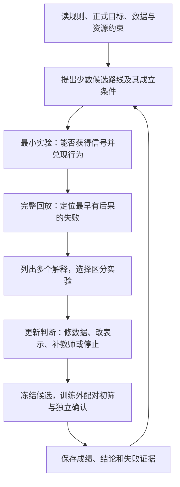
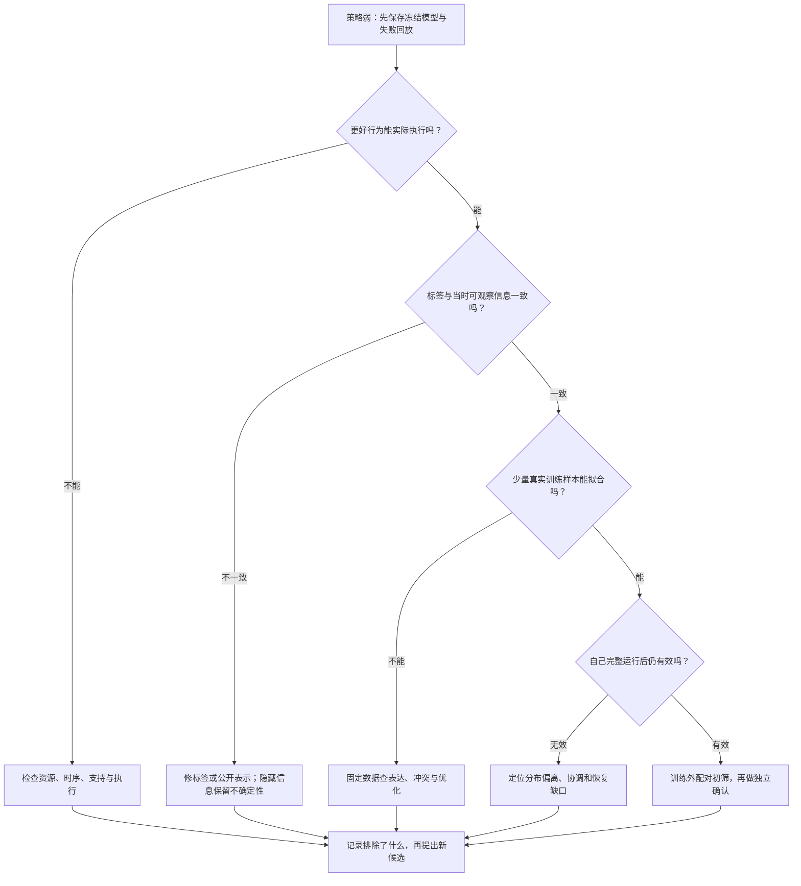

# 从知道 BC 到形成强解法：Kaggriculture 的认知复盘

这次复盘要回答的是：**我也知道、也尝试过行为克隆，为什么没有像优秀参赛者那样把它做成强方案？以后怎样思考、怎样实验，才能逐步具备这种解题能力？**

历史版本的失效机制仍然重要，但它们只是材料。本文的主线是如何识别问题、组织学习任务、选择证据和分配实验预算。具体历史数字留在 [实验历史](experiment_history.md)，当前实现与运行命令见 [训练方法](training_method.md) 和 [README](../README.md)。

最值得修正的一种认识是：知道 BC、PPO、Transformer 的名字，离形成一个有效的学习问题还有几步。需要继续回答：向谁学、学哪些决策、标签是否描述了真实执行、不同教师的行为能否组合、模型自己行动后怎样纠错，以及什么结果值得继续投入。这些判断可以通过练习积累。

项目记录能支持我们审计决策方式，不能直接证明你的天赋、性格或当时的心理原因。第一次接触这类比赛时，缺少可调用的问题模式，会让很多选择都显得没有依据。可改进的部分，是把依据和实验方法建立起来；也要承认数据、算力、时间和经验造成的差距。

## 1. 四篇方案实际告诉了我们什么

以下依据你提供的四篇讨论正文，读取于 **2026-10-03**。标题中的名次及文中的 top 10 都是作者发帖时的暂定状态，本文不把它们写成已确认的最终金牌名次。做法和效果是作者报告，不是我们复现的结果。

| 方案 | 作者明确写出的做法与取舍 | 可以提炼的问题 |
| --- | --- | --- |
| [745367：Chasing the Top Teams with Behavior Cloning](https://www.kaggle.com/competitions/kaggriculture/discussion/745367)，DECEM | 按队伍、版本和胜负条件化，强调新数据与单队专门微调；自回归单位决策。尝试 RL 后，按实际能翻转多少胜负判断投入，最终保留 BC 与两条保护规则。 | 教师在进步时，旧数据还有多少价值？多种策略混在一起会怎样？收益是否改变胜负？ |
| [745258：Highlights + Code and Diagrams + LeJEPA](https://www.kaggle.com/competitions/kaggriculture/discussion/745258)，MarvinTMB | BC 初始化后做 PPO 自博弈 league；报告策略塌缩，临近提交加熵未及时修复。他认为 critic 预训练可能避免问题，这仍是事后假设。 | BC 后的在线学习是否稳定？哪项证据能区分价值估计、探索和对手分布的问题？ |
| [745119：No RL, no search](https://www.kaggle.com/competitions/kaggriculture/discussion/745119)，Yaroslav Pudovkin | 最终纯 BC：按实际执行重建标签，多教师预训练后单队微调及权重平均；整回合草稿经 corrector 协调。按配对种子现金选模型，报告模仿指标与实战分离。 | 标签学的是请求还是执行？多头决策能否协作？离线指标能否预测比赛？ |
| [745036：It’s SFT all the way down](https://www.kaggle.com/competitions/kaggriculture/discussion/745036)，Russell Kirk | 用自回归动作监督，偏重新鲜强队赢家；放弃宏观路线与多条模型分支。强调并行保留少数想法，每条都有保底、最好版本和实验版本，再做配对比赛。 | 如何更新数据？如何在保留成绩的同时试错？什么时候终止喜欢的路线？ |

读这四篇，首先应看到分歧。DECEM 使用教师条件化，Yaroslav 报告其多教师条件化尝试更弱；有人自回归生成，有人整回合生成后协调；有人继续 PPO，有人把预算转回数据。这些差异说明，**共同的 BC 起点并不对应唯一的正确配方。** 不能只因一篇成功就把它的局部取舍升级成所有比赛的规律。

也要保留评估边界。Yaroslav 用现金选模，不能直接移植为本项目的晋级目标；Russell 承认部分验证数据后来进入训练，原验证不能继续算独立确认；DECEM 的固定回放续作能检查局部变化，但不能代替会反应的对手。这里的学习目标与晋级依据仍是终局胜/平/负 **1/0.5/0**，现金与现金差只用于诊断。

另外，我们已经借鉴的 [msdsm 固定源码](https://github.com/msdsm/kaggriculture-solution/tree/84057a0fda4238ccdebc46f9bf5496c6c4b2e00d) 展示了另一种路径：检查自己策略的弱点、改进规划器、补示范，再进入 BC/PPO。[教师数据说明](https://github.com/msdsm/kaggriculture-solution/blob/84057a0fda4238ccdebc46f9bf5496c6c4b2e00d/docs/data.md) 支持这个过程，但不提供各组件对我们策略的独立收益证明。它与上述四篇应分开比较。

## 2. “为什么他们能想到”：把结果倒推成可以训练的思考步骤

我们无法还原每位作者脑内的推理。下面是依据问题结构整理的**事前推导练习**，不是声称作者都按这个顺序思考，也不是事后保证这条路线必胜。

### 2.1 先找最便宜、最可靠的学习信号

比赛有公开的强策略回放。一场游戏只有一个最终胜负，却包含整季的观察与动作。面对长操作链，应先提出：已有行为能否提供比随机探索更直接的起点？这会把完整动作 BC 放进早期候选路线。

接着要做最小验证：能否取得完整回放、识别教师座位、对齐观察和动作、训练出能完整跑局的策略？回放多不等于独立信息多；强策略也可能需要未记录的内部计划。**BC 值得先试的依据，是可获得的监督信号与探索成本，而不是赛后发现别人用了它。**

### 2.2 先定义模型的责任，再选模型

模型要决定整个回合，还是只修改已存在的计划？工人动作与交易分开输出后，谁负责协调？哪些关系必须从公开观察里识别？这类问题应先于“用多少层 Transformer”。

对 Kaggriculture，可以先写出：地块、单位、商品、时间、现金和市场如何相互影响。多个工人会争同一任务，生产依赖材料，交易依赖入仓时序。表示和输出结构必须让这些关系有机会被表达；是否学得好，再由实验回答。实体表示、顺序解码、联合协调都是可测的设计选择。

### 2.3 把数据当作策略设计的一部分

“下载排行榜前二十再一起训练”只是数据获取方式。还要判断：不同队伍的策略是否兼容？历史版本是否过时？某个教师很强，但它的决策能否由当前观察解释？稀有开局和市场条件是否被大量常见动作淹没？

多教师能扩大覆盖，也可能把相互依赖的计划混成不协调的动作。单教师更一致，也可能覆盖窄。条件化、分阶段微调、更新教师或补充规划器示范，都是候选办法。**先测自己数据的矛盾和缺口，再决定用哪一种。** 教师输了某一局，也不代表其每个动作都坏；赢家过滤同样不是无需验证的规则。

例如，怎样自己想到“先广泛预训练，再专门微调”？可以从两个需求推导：基础操作要覆盖广，具体经营要连贯。由此提出假设：多教师适合建立基础，后续用一致教师减少计划混杂。接着用同预算比较它与单教师从零训练、直接混合训练。只有比较支持这个假设，才采用阶段化；如果混合本来就更好，就保留混合。这样获得的是一个有来由、能被推翻的想法。

### 2.4 把完整执行当作学习问题的一部分

回放上预测正确，不保证自己行动后还能正常经营。一个采购偏差就可能造成缺料，缺料改变路线和收获，后续观察逐渐偏离教师经历过的状态。

因此，要同时看教师状态上的离线预测和自己运行出来的回放。出现失败后，定位最早产生实质后果的偏离，检查是输入、标签、协调、执行还是恢复能力的问题。动作不同也可能是等价的好选择，不能把每一次不一致都当错。[DAgger 原始论文](https://proceedings.mlr.press/v15/ross11a.html) 讨论了策略改变后续状态分布的问题；这提供分析视角，不意味着本项目已经实现 DAgger。

### 2.5 根据可区分的解释设计实验

“BC 不够强”没有告诉我们该做什么。至少可能有以下解释：教师本来不够强；标签不一致；输入不足；策略混合；模型未拟合；自己执行后遇到数据外状态。它们要求不同的实验。

经验丰富的解题方式，可以表现为更快提出这些候选解释，并选择能排除其中几项的检查。需要练的是这种实验判断力。一个失败实验如果排除了关键解释，也可能比一个原因不清楚的小幅涨分更有长期价值。

### 2.6 用机会成本决定继续哪条路线

选择实验要同时看预期比赛收益、能够减少的未知，以及完整成本。训练更新、数据处理、采集、评估和排错都占预算。

如果一项修改只让已经稳赢的局赢得更多，继续优化它的优先级可能很低。如果训练很慢，先检查是不是数据处理或模拟限制；如果标签大多重复和中性，提高吞吐也可能只是在更快地产生低信息样本。具体预算应用自己的测量制定，不能照搬作者的硬件与训练时长。



**图 1：从问题到判断。** 每轮改变的是我们对问题的认识，再据此决定下一步；不是每轮都需要换网络或开启长训。

## 3. 我们当时的差距，哪些有项目证据

认知复盘应落到真实决策与证据，避免用“经验不足”解释一切。以下是记录支持的工作方式缺口。

| 记录中发生的事 | 暴露出的判断缺口 | 下次应先问的问题 |
| --- | --- | --- |
| `plan_compare` 每局只测两个状态的局部替代，却让网络覆盖约 360 个经营时点；未覆盖开局随后被破坏 | 没有让训练证据与部署责任匹配 | 模型要接管的每类状态与候选，有什么监督或保护？ |
| 保住部分局部排序后，完整比赛仍退步 | 把局部指标当成完整能力的充分证据 | 哪个小指标曾在我的策略上预测过完整比赛？ |
| 早期后续事件比较只有 Keep/Cancel，生产候选因维护时序缺失 | 先从学习器解释行为，没有先检查真实选择空间 | 这个状态中，好行为真的能被选择和执行吗？ |
| 修归一化、菜单覆盖、交接后仍无稳定提升 | 将真实修复过早视为整体根因已解决 | 修复了哪一层？剩余失败还有哪些独立解释？ |
| 继续策略变化反复使比较标签失效；大量后续比较重复或不改胜负 | 没有充分估算有效信息与协议成本 | 一小时得到多少新的、可用于学习的区分证据？ |
| 归档明确记有多次诊断过早转成夜训建议 | 根因假设到昂贵实验之间缺少关卡 | 最便宜的反驳实验是什么？什么结果会让我停止？ |

依据：[接管失败](experiment_history.md#plan-comparison)、[event 审计](experiment_history.md#event-audits) 和归档中的后续教训。上述事实不能推出每次失败都由同一个原因造成，也不能把所有责任归给你个人。

一个典型思考转变是：从“网络还没学会，所以再训”，推进到“我不知道它在哪一层失败，先把不知道的部分分开”。

同时，历史里已经积累了有价值的能力：plan 的参数搜索找到了更好配置；受控改进接受过三次局部变化；event evidence 有一次新种子确认的阶段进步；批量生产、共享路线、账本和交接都形成了工程资产。完整菜单、概率与梯度审计，也让我们能够排除“数据根本没进入网络”的简单解释。**复盘应保留这些判断能力，再改进试验顺序。**

## 4. 为什么“我也用了 BC”不足以直接比较

首先确认我们比较的是不是同一种任务。

| 项目中的任务 | 已有证据能说明什么 | 不能由此说明什么 |
| --- | --- | --- |
| 早期 Python 路线示范与预训练 | 归档保留了示范拟合与接口检查 | 原始教师资料不足，不能补造完整监督范围，也不能称已达到完整动作 BC 的实战水平 |
| plan/event 局部菜单学习 | 固定继续策略下，比较有限方案的终局结果 | 它不是完整动作 BC；局部比较不能自动授权未覆盖整局接管 |
| 当前完整动作 BC | 公开教师轨迹监督单位和市场动作，随后完整对局评估 | pipeline 接通、loss 下降或训练轮数完成，不等于已复现公开作者成绩 |

其次，即使都是完整动作 BC，至少还有五个实质问题：

1. **教师质量与一致性。** 强度、版本、状态覆盖和可模仿性不同；混合后可能需要处理策略冲突。
2. **监督语义。** 模仿原始请求、实际成交或重建后的意图，分别需要怎样的执行器配合？不存在脱离合同的通用最好标签。
3. **决策之间的关系。** 单位、交易与资源共享如何协调？独立预测的局部正确动作可能无法合成有效回合。
4. **自己的状态分布。** 模型偏离教师之后，能否恢复？需要补示范、规则、在线学习还是更好的观察？
5. **实际交付行为。** 训练中的采样、推理中的 greedy、动作限制和后处理是否采用一致语义？评估是否使用准备部署的完整策略？

这些才是“BC 用得好不好”的具体内容。不能只比较算法名字、模型参数量、训练时长或教师数量。

也不能走向另一个极端：“纯 BC 能做到这么好，所以以后都不用 RL。”四篇材料没有统一消融；成功作者也面对不同的数据、硬件和时间约束。应把 BC、在线学习、规划和规则视为可选择的分工，用自己的证据决定。

## 5. 最需要练的能力：看到结果后，知道下一步查什么

下面是实验决策表。它们是建议的区分检查，不是已经确认的当前 BC 病因，也不是要求现在启动新训练。

判断监督拟合时，优先看有效标签的交叉熵、分动作和分阶段指标；含熵与 KL 的总 loss 不能直接替代它们。离线留出预测与自己完整运行的比赛也要分别记录。

| 当前现象 | 至少两个可能解释 | 先做的区分检查 | 结果如何影响下一步 |
| --- | --- | --- | --- |
| 小训练集也拟合不好 | 标签/通路有误；表示、模型或优化不足 | 固定少量真实样本，核对标签与梯度；比较单例和小集合拟合 | 单例失败先查连通与局部表达；单例成功、集合失败再查条件冲突和优化 |
| 训练拟合好，按整局隔离的监督留出指标差 | 过拟合；教师/版本/场景分布不同 | 按整局、教师、版本和阶段拆指标，核对分布 | 有明确缺口就补数据；不能只增加同分布重复样本 |
| 动作准确率高，自己完整对局仍弱 | 教师不够强；常见动作掩盖关键错误；自己运行进入不同状态；执行语义不一致 | 跑冻结策略，定位首次有后果的偏离并对齐执行；教师可执行时，同条件评估教师 | 分别改善教师、关键决策、恢复数据或执行合同；只有回放时不能宣称测到教师上限 |
| 多教师混合比单教师弱 | 策略不兼容；数据量、训练预算不同 | 固定表示与近似相同更新预算，比较单教师、混合、先预训练再专门微调 | 一致教师更好才支持阶段化；同时记录覆盖损失 |
| 经常缺料、冲突或错过交接 | 没有合法选择；有选择但没选；已经选了却无法兑现 | 看真实 post-maintenance 观察、完整候选、资源前缀与执行回执 | 先判断失败层次，再决定改支持、学习或执行 |
| PPO 后退步 | 价值估计、探索、执行合同或策略漂移 | 固定 BC 起点，审计请求概率和执行，检查 critic 校准与旧行为变化 | 连通与合同成立后，再做小预算学习比较；不把 critic 预热当保证 |
| 自身现金提高，得分没有提高 | 增益集中在已赢局；对手也受益；对手面板偏窄 | 看同 seed 换座的逐局胜负翻转与对手分组 | 现金解释机制；继续投入由比赛得分证据决定 |

这里有两点容易做错。

**第一，不要把“只改一个变量”变成形式要求。** 探索早期可以测试一个完整的新表示或学习任务。它若有效，再拆关键因素；要归因“是哪一项起作用”，才需要控制其他条件。无论改动多大，都应保留明确的对照和预算。

**第二，小实验与完整比赛回答不同问题。** 单例过拟合证明局部连通；机制案例证明某个行为能兑现；开发面板帮助选模；独立确认检验冻结候选。前一层通过，才有理由进入后一层，不能把前一层结果包装成最终强度。



**图 2：实验先用来分辨原因。** 路径是检查优先级，失败可能同时包含多层问题；不是一张能自动宣布唯一根因的流程图。

## 6. 下次比赛，怎样从第一天组织工作

### 第一步：写一页问题地图

先写清正式目标、观察与隐藏信息、动作执行顺序、时间跨度、推理限制、可获得的教师与模拟成本。对农业经营，画出现金到投入、维护、生产、运输、入仓、交易和终局得分的完整链。

从强策略回放中提取可测行为。例如 DECEM 历史五场回放支持连续生产、条件续种/转产、共享材料与工作路线、现金周转。它们是行为检查标准，不能从回放推断训练算法；现在可以另外引用作者公开披露，但未披露部分仍未知。[历史回放证据](experiment_history.md#replay-evidence)

### 第二步：保留少数路线，尽早验证成立条件

有强回放时，完整动作 BC 应成为早期候选；有可执行规划器时，教师或搜索 baseline 也值得比较。每条路线先写“它靠什么成立”：数据能否取得、标签能否重建、是否能完整运行、成本是否可承担。

同时保留一个稳定 baseline。候选实验有自己的目录和检查点，不能因为开始训练就替换已接受行为。探索路线可以不同，最终部署仍需要确认。

### 第三步：尽早闭合最小的完整学习循环

先完成一条小规模但真实的链：数据 → 模型 → 完整行动 → 比赛 → 失败回放。目的是早发现训练与执行之间的问题，而不是证明小样本已经有竞争力。

只有局部 head 的 loss，会让很多未知推迟到最后。完整循环能够告诉我们：数据究竟在教什么，自己的策略怎样失败，下一批数据应该补什么。

### 第四步：按能力缺口安排实验

每次只把少数有证据的问题带到下一轮。区分缺少基本操作、关键状态未覆盖、策略组合不一致、执行破坏意图和优化不足。

有些缺口需要改教师；有些要改输出结构；有些适合确定性执行规则；有些才适合在线学习。新增能力必须说明采集、标签、执行和部署如何采用同一合同。事件标签依赖继续策略时，记录版本；时序、执行或目标变化后，重算依赖标签。

### 第五步：把评估当作实验仪器来检查

训练集用于学习；诊断集用于分析；开发面板用于选模；另一批独立种子用于最终确认。按整局/seed隔离，避免一场的两座位跨训练与验证。

完整候选在同 seed、同对手、换座条件下做配对比较，再确认同一冻结文件。对手面板要能暴露不同经营行为，也要抽查它与真实赛场是否出现明显不同的结论。小样本结果保留区间与样本边界，不能把固定面板得分率当总体胜率。

最终确认里的失败不可直接变训练示范。先在另一批诊断 seed 上复现同类问题；原确认种子保持留出。反复查看的开发面板也不能重新命名为未见测试。

### 第六步：按信息与成本停止实验

开始前约定完整预算和停止条件。例如：数据中几乎没有可区分机会，就先修证据生成；合同检查失败，就暂不长训；一个候选只在选模面板进步，先做独立确认。

失败不要求立即放弃整条路线，但要求更新解释。同一个未经支持的理由，不应连续支撑多次昂贵训练。增加预算也应有依据，例如学习曲线仍在改善、关键行为尚未收敛，并且资源允许。

## 7. 怎样训练“我以后能自己想到”的能力

### 7.1 阅读方案时，遮住答案练推导

每次选一篇方案，先只读规则、可用数据和约束，写下两个候选路线及成立条件，再读作者方法。不要先记模型层数和训练参数。

读完用五行记录：

```text
问题结构：它面对什么数据、长链决策、协调和成本？
关键判断：作者选择了什么，放弃了什么？
证据：是自报比赛、消融、机制检查，还是作者解释？
事前推导：当时有哪些可见线索，能让我提出这个假设？
最小验证：如果换成我的预算，怎样验证它是否适用？
```

一篇读透后，再读采用不同取舍的方案。能解释两种相反选择各自的条件，比积累一长串“冠军技巧”更有用。

最后做两个反事实：如果拿不到强回放，原路线还能成立吗？如果推理预算缩小十倍，哪些部分必须重新设计？这能检查你学到的是特定比赛的配方，还是可迁移的判断。

### 7.2 每次失败至少提出三个解释

例如“模型不扩地”，先列：教师很少扩地；条件未被编码；混合策略冲突；之前的采购或路线偏差已使扩地不划算。不要马上选一个熟悉的解释。

然后选能改变判断的检查。核对教师分布；看真实现金与合法选项；固定状态替换一组公开输入；比较同预算的教师组成。人工替换输入只用于诊断，可能产生不自然状态，结论还要在真实回放验证。

### 7.3 给每次判断记预测，训练校准能力

运行前写出最可能的结果、替代结果，以及哪些结果会改变方案。运行后保留原预测，记录哪里判断对、哪里错。

要逐步识别自己是否总在失败后才说“本来就应该这样”，是否习惯把所有失败归为模型不够大、训练不够久或某个最近读到的概念。好的复盘能让下一次预测更准确。

### 7.4 积累问题模式，而不是版本名称

建立自己的索引，例如：稀疏终局信号、多个教师的行为冲突、训练与部署范围不一致、请求与执行不同、关键条件不可观察、离线拟合与完整运行分离、后处理改变策略、评估分布偏移。

每个模式只保留四项：典型症状、一次有证据的案例、最便宜的检查、检查成立后仍然不知道什么。这样遇到新比赛时，才有可调用的知识。

### 7.5 用固定时间做“解释分歧”的练习

可以每周选一个主题：第一周比较教师选择，第二周比较动作协调，第三周比较完整运行与补课，第四周比较实验预算和评估。每次产出一页对照和一个可执行的小实验设计。

判断进步时看：是否更快定位失败层次；是否能说清不确定性；是否减少了重复无效训练；是否更早保住已有成绩；是否能用自己的证据终止喜欢的方案。最终名次受外部条件影响，这些过程能力更适合持续练习。

## 8. 使用助手时，也要保留自己的实验判断

如果只问“怎么让模型更强”，很容易得到网络、更大的数据集或更长训练等建议。提供具体证据，并要求解释能够被实验区分，会更有帮助。

可以使用下面的提问方式：

> 当前策略在这些真实局面失败。请先区分事实、结构限制和假设，提出至少三个解释，核对哪些已被历史实验排除，再设计最便宜的区分检查。说明每个结果会改变什么决策，以及何时才值得正式训练。

助手应帮助你发现盲点、检查代码和组织对照。建议仍需要证据；“听起来解释得通”不能直接升级成夜训命令。过去多次过早推进训练也是协作方式需要修正的部分。

## 9. 不要把复盘变成事后自责

**别人也绕过远路。** 四篇材料有放弃宏观路线、策略塌缩、无收益规则和 RL 的记录。赛后写出来的方案已经经过筛选，读者通常看不到全部尝试。不能把最终路径当作作者第一天就知道的答案。

**当时可知与后来可知要分开。** 新教师版本、赛后公开的执行细节和代码，不应被假定为你当时已掌握的信息。值得追问的是：利用当时能得到的回放和规则，哪些小实验可以更早暴露问题？

**算力和数据不应被“认知”吞掉。** 固定参考的 [训练谱系](https://github.com/msdsm/kaggriculture-solution/blob/84057a0fda4238ccdebc46f9bf5496c6c4b2e00d/docs/training-lineage.md) 报告了大规模、多阶段训练。我们不能把同一框架的小规模运行视为同等资源实验，也不能因此认为所有差距都由训练量解释。

**相同结果不意味着相同原因。** 旧 mixed 的规模限制不能套给当前 plan/event；归一化、完整菜单或交接已经修复的部分，不能继续重复列为当前根因。当前代码已有批量生产、经济路线、两阶段转换，学习选择与执行兑现仍要分别判断。

更有用的自我评价是：这次没有及时提出哪些问题，哪些证据本可以更早收集，下次我用什么动作改变这个过程。这样的复盘会产生能力，而“我当时怎么这么笨”不会告诉我们下一步怎么做。

## 10. 对当前项目，这份复盘怎样落地

本文只改写文档，不更改训练目标、执行合同、检查点或部署，也不启动新训练。

改写时，本地 `runs/action_bc_own_public_stream` 至少已有 epoch 5 的保存记录：验证单位准确率约 90.56%，市场准确率约 94.23%。这些说明监督学习在进行，仍不能说明完整比赛强度。缓存包含 1,986 条教师座位轨迹、1,835 场不同对局；轨迹、行数与独立游戏不能混为一个样本量。这里是读取时的快照，不是训练完成报告。

接下来有判断价值的工作是：冻结准备评估的 checkpoint；取得训练外的完整比赛与自己的失败回放；将错误按阶段和行为分类；再从第 5 节选择区分检查。没有这些证据前，不应先宣布需要教师条件化、单队微调、更大网络或 PPO。

旧 BC OOM 已由流式读取修复，这是资源方案的改进，不是 BC 方法无效或比赛能力提高的证据。既有缓存、初始化与失败目录应继续保留；不兼容的训练合同不能声称原样续用。具体处理仍以 [BC 指南](action_bc_pipeline.md#模型与训练) 为准。

需要补教师时，先证明教师在公开信息下能执行更好的行为，并覆盖实际缺陷；再建立新的数据和学习阶段。当前教师入口是从 seed 重开完整局，不会恢复失败中间状态，也未迁入参考全部商店分布课程。它的能力边界见 [教师闭环](training_method.md#10-搜索教师与新一轮学习)。

## 11. 一张可以复制的认知与实验记录卡

```text
【问题与已有知识】
正式目标：
真实失败：版本、seed、对手、观察、实际动作与后果。
现在确定的事实：
历史已排除/已修正的解释：
当时可获得的信息与约束：

【候选解释与决策】
解释 A：支持与反证；当前信心。
解释 B：支持与反证；当前信心。
解释 C：支持与反证；当前信心。
最便宜的区分检查：为什么选它？
若出现结果 X：下一步做什么？
若出现结果 Y：停止什么或转向什么？

【实验合同】
具体缺失能力与预期行为变化：
改动与对照：控制哪些因素，暂不归因哪些因素？
采集/标签/执行/部署如何一致；继续策略版本：
接管范围与已接受行为保护：
训练、诊断、开发及独立确认 seed 的隔离：
完整预算、资源上限和停止条件：

【结论与认识更新】
机制检查说明了什么：
学习与完整比赛分别说明了什么：
冻结文件、逐局胜负与独立确认结果：
哪些解释被削弱或排除，哪些仍未知：
我的事前预测错在哪里，下次应更早问什么：
保留的源码、配置、数据、标签、权重与原始结果：
```

一张卡片不必全部写满。关键是运行前写判断与停止条件，运行后让结果改变认识。这样，即使实验失败，也能为下一次决策留下可以使用的证据。

## 12. 查阅入口

- [实验历史](experiment_history.md)：Python、mixed、plan、event 的实测边界、失败审计与局部成功。
- [训练方法](training_method.md)：当前完整动作 BC、critic、Rust PPO、验收和教师闭环。
- [BC 指南](action_bc_pipeline.md)：教师索引、标签、缓存、流式读取、恢复和完整对局。
- [PPO 指南](action_ppo_pipeline.md)：概率与执行一致性、继续策略、独立确认和部署保护。
- [实现验证记录](pipeline_validation.json)：已经验证的实现与尚无正式强度结果的部分。
- [README](../README.md)：实际运行命令，历史或公开作者命令不能直接替代当前入口。
