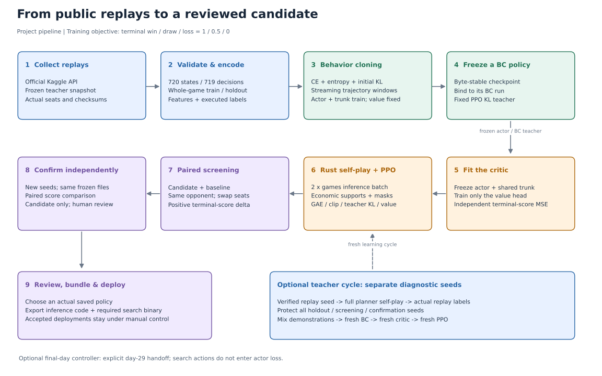
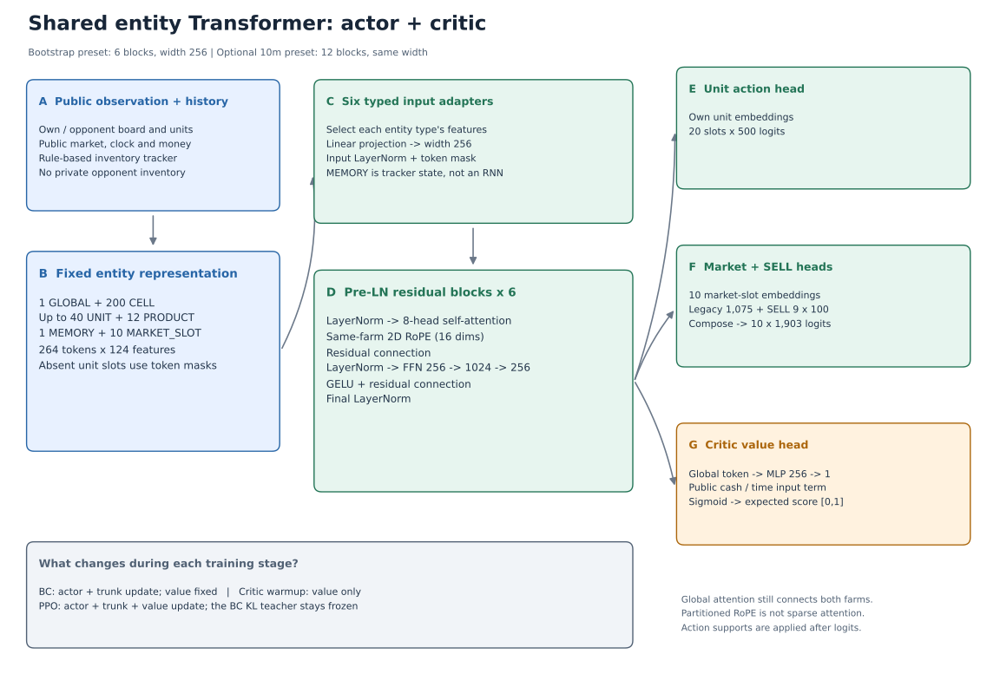
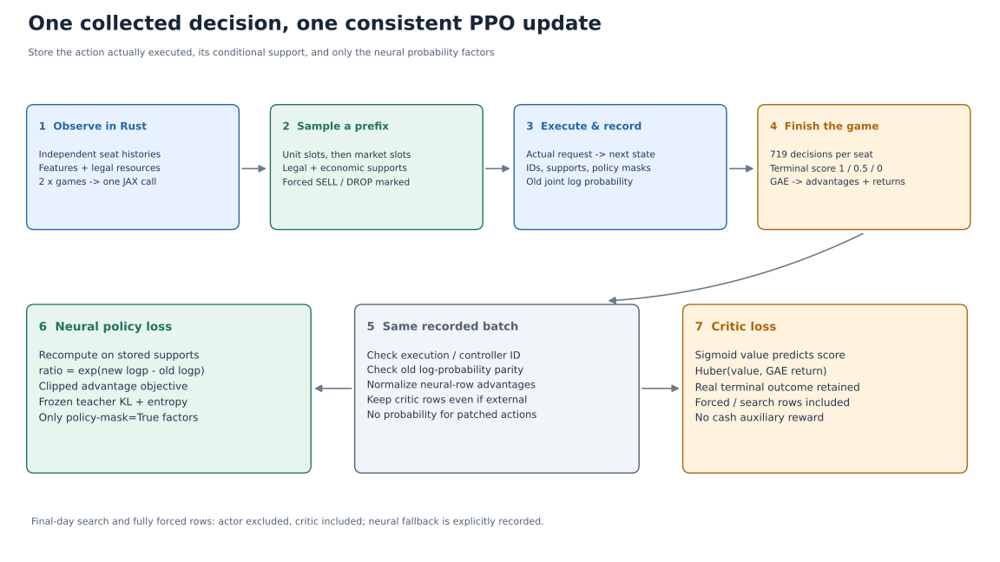

# 我们的完整训练方法：从数据采集到最终候选策略

本文解释本项目 `v0.7.0` 完整动作 pipeline 的训练原理、数据流和交付过程。实际安装及连续运行命令以 [README](../README.md) 为准；数据和故障排查见 [BC 指南](action_bc_pipeline.md)，执行、恢复和评估合同见 [PPO 指南](action_ppo_pipeline.md)。这里的“完成训练”指形成经过独立对局确认、可以人工审查和打包的候选，不代表入口会自动替换已接受策略。

同样知道 BC，为什么解题判断与优秀方案仍有差距，以及怎样训练这些判断能力，另见 [从知道 BC 到形成强解法：认知复盘](experiment_retrospective.md)。

我们采用的是 **公开回放行为克隆（BC）→ 冻结策略拟合 critic → 完整赛季自博弈 PPO**。经济规则约束动作的合法选择，季末搜索可以作为独立控制器加入；另有“诊断失败 → 规划器示范 → 新 BC → 新 critic → 新 PPO”的补充学习循环。

方法和代码已经接通，正式训练结果需要按运行记录判断。当前主线 BC 使用六层 `bootstrap`，目标 30 个 epoch；critic/PPO、教师示范和季末控制器是后续可执行阶段。已有实现检查不是经营改进、采集加速倍数或胜率提升的证据，具体边界见 [验证记录](pipeline_validation.json)。

## 1. 先看完整流程



**图 1：完整流程。** 蓝色表示数据，绿色表示模仿学习，橙色表示在线学习，紫色表示比赛验收和交付。图中的 teacher 循环使用单独的诊断种子，不把初筛或确认种子重新放进训练。

| 阶段 | 输入 | 在做什么 | 主要输出 |
| --- | --- | --- | --- |
| 1. 采集公开回放 | 官方 Kaggle API、教师队伍/提交快照 | 识别教师的真实座位，下载兼容且正常结束的对局 | 原始回放、`teachers.json`、`teacher-seats.jsonl` |
| 2. 校验与编码 | 完整回放及座位索引 | 对齐观察和动作，检查实际执行，整局划分训练/留出 | 逐轨迹 `.npz`、准备记录、缓存清单 |
| 3. BC | 缓存、初始化模型 | 用监督标签训练 actor 和共享 Transformer | `epoch-N-policy.pkl`、`final_student_jax.pkl` |
| 4. 固定 teacher | 已保存的 BC 策略 | 冻结文件身份，成为 PPO 的固定 KL 参考 | 固定的 BC `.pkl` |
| 5. critic 拟合 | 固定 actor、完整自博弈结果 | 只训练价值分支，独立验证选择 best critic | `policy_with_critic.pkl` |
| 6. PPO | 带 critic 的策略、固定 BC teacher | Rust 批采集真实对局，用 GAE 和 clipped PPO 更新 | `policy-update-N.pkl`、优化器状态、指标 |
| 7. 配对初筛 | 冻结候选、baseline、固定对手 | 同种子换座，比较真实终局比赛得分 | screen 报告、逐局记录 |
| 8. 独立确认 | 初筛通过的同一组文件 | 换另一批种子，确认候选的得分变化 | confirmation 报告、`candidate_only` 结果 |
| 9. 审查和交付 | 实际策略文件、确认记录 | 人工决定是否接受，导出候选推理包 | `main.py`、精简策略、依赖与文件清单 |

BC 提供“通常该做什么”的起点；critic 学习“当前状态最终有多大机会拿到比赛得分”；PPO 根据自己完整执行后的结果调整决策。三者的监督信号不同，不能用 BC 准确率或 critic 误差替代比赛验收。

## 2. 比赛目标：学习终局得分

每局记录 720 个状态，单个座位作出 719 次决策。我们唯一的强化学习回报来自实际终局：

| 结果 | 学习回报 |
| --- | ---: |
| 赢 | 1 |
| 平 | 0.5 |
| 输 | 0 |

现金、库存、土地和雇工状态可以成为观察；现金差也可以帮助诊断经营行为。它们不作为额外奖励，也不作为候选晋级的否决条件。critic 的训练标签仍来自比赛得分，搜索内部的现金流预测也不能替代实际终局胜负。

两座位对称自博弈的平均得分恒为 0.5，因此不能看到自博弈平均得分稳定就声称策略更强。最终判断需要训练外、固定对手、换座配对的比赛。

## 3. 数据采集：先取得可靠的教师轨迹

### 3.1 教师是一个座位，不只是赢家

[下载器](../src/route_rl/replay_download.py) 从官方 episode agent 元数据中的 submission ID 和座位 index 识别教师。一局可能包含两个教师座位，产生两条训练轨迹；它仍然只有一个独立对局。

README 的采集示例冻结公开前 20 支队伍的快照，每位教师最多下载 100 局：

```bash
bash tools/download_public_bc.sh data/action_bc 20 100
```

重复执行会复用教师快照与已有回放，继续补足额度。当前排行榜和可访问回放会随时间变化，因此复现同一次实验必须保留原教师清单、原始文件和下载记录；重新运行下载命令不会自动得到完全相同的数据集。

下载和准备过程要求完整观察、动作及正常 `DONE` 终局，核验已支持的回放版本，排除 seed=0、异常结束和不兼容回放，保存文件校验值及跳过原因。正常完成的胜、平、负都可以保留；教师的失败局也包含可学习的局部决策。

### 3.2 原始回放如何变成一个训练样本

回放中动作与观察的索引必须正确对齐：

```text
第 t 个状态的 observation  ->  第 t+1 个记录中的 action
每个教师座位：719 行
每行：观察特征 + 20 个单位标签 + 10 个市场标签
```

[标签生成器](../src/route_rl/full_action/labels.py) 调用已核对的官方规则检查请求是否真实执行。无效、未执行或 padding 动作使用忽略标签 `-100`，不作为交叉熵正例。SELL 标签记录实际成交的绝对数量，避免把“请求卖多少”误当成“实际上卖多少”。

这里的标签过滤与 PPO 合法采样是不同机制：BC 过滤监督样本中的错误标签；PPO 在采样之前限制候选集合，随后记录自己真正执行动作的概率。不能把前者理解成 BC 已经使用经济掩码训练。

### 3.3 训练和留出必须按整局划分

当前 BC 使用 `sha256("50:" + episode_id)` 的前 8 字节转整数，再按 `% 10 == 0` 分到留出集，约占 10%。同局双方始终同组，已知相同 seed 的不同 episode 若跨组则拒绝准备。

不能把一局的前半段用于训练、后半段用于验证，也不能把双方拆到不同组；它们共享地图和比赛结果，会产生泄漏。缺失 seed 的回放会单独计数，不能声称这些未知 seed 与未来评估完全独立。

已有 `action_bc_own_public_stream` 的准备记录包含 1,986 条教师座位轨迹、1,835 个独立对局，训练/留出分别为 1,292,762 / 135,172 行。这是这份冻结数据清单的规模，不是未来每次下载的保证，也不是参考作者的历史数据。

## 4. 观察编码：把农场变成模型能理解的实体

每个样本使用固定的 `264 × 124` 特征矩阵。264 个 token 是实体槽，124 维是统一特征容器；不同实体只使用其中与自身相关的字段。

| token 类型 | 槽数量 | 主要含义 | adapter 取用的特征维数 |
| --- | ---: | --- | ---: |
| GLOBAL | 1 | 时间、双方公开现金和农场摘要 | 34 |
| CELL | 200 | 双方各 100 个格子，地块/作物/动物及生产状态 | 34 |
| UNIT | 最多 40 | 双方农场主和工人，位置、状态及携带物 | 22 |
| PRODUCT | 12 | 商品、库存、市场和产出相关信息 | 19 |
| MEMORY | 1 | 对手公开库存估计及不确定性 | 50 |
| MARKET_SLOT | 10 | 十个市场订单槽的槽标识 | 10 |

没有实体的槽位通过 token mask 忽略。模型当前最多完整处理 20 个己方单位、40 个总单位；BC 超限教师轨迹拒绝编码，PPO 采集超限会明确停止。不能把这种固定容量描述成任意规模的完整农场模型。

库存 memory 由 [public inventory tracker](../src/route_rl/full_action/inventory_tracker.py) 持续读取实际公开观察和历史动作更新，包括库存、携带物及估计不确定性。它不是 RNN 隐状态，不是对手私有库存，也不会凭空补出未来工人或未观察到的资源。网络每次仍是对当前实体矩阵做前向计算。

准备后的特征缓存为 float16，标签为 int16；训练读取时构造 float32 输入，网络主要计算默认使用 BF16，并在需要的数值路径保留 FP32。这几个 dtype 分别描述存储、输入和计算，不能混为一谈。

## 5. 模型结构：一个共享 Transformer，三个输出方向



**图 2：共享模型结构。** 单位动作、市场动作和 critic 共用实体编码与 Transformer 主干。市场输出还包括绝对 SELL 数量头；最终动作的合法条件支持集位于 logits 之后，不改变图中的主体网络。

### 5.1 当前六层模型与十二层预设

| 设置 | 当前 `bootstrap` | 可选 `10m` |
| --- | ---: | ---: |
| Transformer block 数 | 6 | 12 |
| 模型宽度 | 256 | 256 |
| attention head 数 / 每头维数 | 8 / 32 | 8 / 32 |
| FFN | 256 → 1,024 → 256 | 相同 |
| 激活 / dropout | GELU / 0 | 相同 |
| RoPE 维数 / base | 16 / 100 | 相同 |
| 完整初始化参数量，含 value 分支 | 5,486,510 | 10,225,070 |

当前 README 命令初始化并训练六层 `bootstrap`。`10m` 是已提供的十二层配置，并不表示当前训练已经扩到十二层；更换层数要建立独立实验。参数量来自当前初始化结构，不能据此推断相同架构已达到参考最终模型的水平。

### 5.2 输入适配和注意力

六种 typed adapter 分别选取实体相关字段，再线性投影成 256 维，进行输入 LayerNorm。每个 block 是 pre-LayerNorm 残差结构：

```text
hidden -> LayerNorm -> 多头 self-attention -> 加回 hidden
       -> LayerNorm -> Linear -> GELU -> Linear -> 再加残差
最后 -> final LayerNorm
```

同一农场的 CELL/UNIT token 对使用二维 RoPE，前 16 个 head 维度中 x/y 各占 8 维。跨农场和非空间 token 对通过 correction 使用未旋转的内积，保留跨实体信息交换。

当前 `partitioned` 路径重排为己方 120、对方 120、全局 24 个 token，并从 features 恢复 metadata。它是计算实现，不是把两个农场分成互不通信的网络：attention 仍覆盖全部 token，也不是稀疏注意力。实现见 [model.py](../src/route_rl/full_action/model.py)。

### 5.3 单位、市场和 SELL 输出

- **单位头**读取己方单位 embedding，输出 `20 × 500` 个 logits，涵盖移动、种植、收获、照料、取料、存放等完整词表。
- **市场头**读取十个 market-slot embedding。原始头每槽 1,075 类，与 `9 商品 × 100 绝对数量` 的 SELL 头组合后，每槽最终为 1,903 类：1,003 个非 SELL 选择及 900 个 SELL 选择。
- **critic**读取 GLOBAL embedding，经 `256 → 256 → 1` 的 GELU MLP 输出 raw value；本项目再取 sigmoid，得到 `[0,1]` 的预计终局比赛得分。

当前 BC 初始化还包含两个置零的 `linear_cost` 参数，兼容公开现金差/时间的 value 输入项。它们属于 critic 参数，不是现金奖励。value 输出和该项均零初始化，因此初始 sigmoid 预测为 0.5；BC 阶段不训练 value 分支，critic 阶段才更新它。

网络一次输出各动作槽的 logits。PPO 的“按前缀条件化”是在这些 logits 上逐槽更新支持集，不是每选一个动作就重新运行整套 Transformer，也不是把网络改成自回归文本模型。

## 6. 行为克隆：监督学习完整动作

### 6.1 BC 学习什么

BC 把公开教师真实执行的动作作为监督标签，通过交叉熵提高对应动作的概率；熵项保留分布多样性，固定初始策略 KL 限制训练漂移。

当前损失为：

$$
L_{BC}=CE_{unit}+CE_{market}
-0.10H_{unit}-0.10H_{market}
+0.05\left[KL(\pi_{initial}\Vert\pi_\theta)_{unit}
+KL(\pi_{initial}\Vert\pi_\theta)_{market}\right].
$$

CE 按有效教师标签计算；熵和 KL 按实际存在的动作槽计算，无效标签不会被当成成功动作。初始 teacher 始终冻结。第一次从随机初始化训练时，KL 参考是随机策略；后续 adaptation 从已有模型开始时，KL 参考则是已有策略，两者的约束含义不同。

BC 更新 actor 和共享主干，value 不进入 BC loss。BC 仍是无经济掩码的完整动作监督；原 BC greedy 推理也保留其既有定义。随后增加经济规则的候选必须显式写入新执行合同。

### 6.2 超参数和当前 run

| 参数 | 配置默认 | 当前 README / 流式 run |
| --- | --- | --- |
| epoch | 2 | 30 个累计 epoch |
| batch | 320 | 320 |
| 主要计算 dtype | BF16 | BF16 |
| 学习率 / Adam epsilon | `1e-4` / `1e-5` | 相同 |
| gradient norm clip | 5 | 相同 |
| 模型初始化 seed | 命令指定 | 0 |
| 训练 shuffle seed | 51 | 51 |
| 设备 | 单进程、一个可见 JAX 设备 | 单张 GPU |

30 个 epoch 是起步实验设置，不是已证明最优的训练长度，也不能复现参考所有早期超参数。基础配置和实现见 [BC 配置](../src/route_rl/full_action/configs/bc.json)、[BC objective](../src/route_rl/full_action/bc_objective.py)。

### 6.3 为什么按窗口读取

参考 BC 生产入口把缓存展开到主机内存；本项目改为流式 `.npz` 轨迹窗口。默认每窗口 16 条，最多驻留两个窗口，即 32 条轨迹；特征缓冲约 1.4 GiB，另有 batch、JAX、模型及优化器开销。

每轮打乱轨迹顺序和窗口内行顺序，跨窗口衔接尾批，每条训练样本恰好访问一次。仅最后一批补齐，padding 不进入损失。验证顺序读取且不更新参数。

这个改动针对已有的主机内存失败：旧全量读取展开约 87.1 GiB，而当时容器上限约 46.6 GiB。减小 GPU batch 解决不了这类主机加载问题。窗口乱序与参考全量行乱序不是完全相同的训练过程，读取合同和窗口参数会写进 run；不能把旧优化器状态原样解释成新读取过程。证据和处理见 [BC 指南](action_bc_pipeline.md#模型与训练)。

### 6.4 BC 何时结束

每完成一个 epoch，执行留出验证，保存 `epoch-N-policy.pkl` 和 `latest_bc_state.pkl`。达到累计目标后输出 `final_student_jax.pkl` 和完成 receipt。再次执行原命令、仅增加 `--epochs`，恢复最近完成的 epoch；中途中断的未完成 epoch 重新执行。

监督验证主要看单位/市场 CE、准确率、熵及 KL，它们说明拟合情况。真实经营能力要读取完整比赛回放和终局得分。已有 epoch 策略可以提前评估，不必把未完成训练的文件称为最终策略。

## 7. 固定 BC 策略，再单独拟合 critic

选择一个已保存的 BC checkpoint，复制到固定文件，用其实际字节校验值绑定原 BC run。之后 BC 的 final 即使继续更新，也不会悄悄改变这份 PPO teacher。

critic 阶段保持 **actor 与 Transformer 主干冻结，只更新 value 分支**。这让价值估计先适应新策略的完整赛季结果，避免预热阶段修改 BC 行为。权重冻结不等于动作执行完全相同：新 critic run 默认采用经济 v2 的支持集，执行身份也必须记录。

每轮默认采集 4 场训练局，另用固定且独立的 2 场验证局：

| 项目 | critic 阶段约定 |
| --- | --- |
| 训练标签 | 完整轨迹的 GAE return，含中间 value bootstrap |
| 验证标签 | 实际终局 Monte Carlo score，广播到各状态 |
| best 选择 | 独立验证的终局 score 预测 MSE |
| 训练 loss | Huber，delta=1，value 权重=2 |
| 学习率 / batch / 每轮 epoch | `1e-4` / 32 / 1 |
| patience | 8 |

拟合前保留 iteration 0；如果后续所有 head 更差，就保留初始 head。`policy_with_critic.pkl` 保存 best critic 与同一冻结 actor，latest state 保留续训优化器。critic MSE 改善只是价值预测改善，不是对战胜率改善。

## 8. Rust 批采集：在线学习的实际数据来源

PPO 不是继续读取公开回放。每轮用本轮策略重新进行完整双座位自博弈，两边各自维护观察历史；固定 BC teacher 只用于 KL，不是每局都拿 teacher 当对手。

默认 `rust-batch` backend 使用从参考方案固定 commit 迁入并适配的 [Rust engine](../native/action_engine/README.md)，代码位于 `native/action_engine/`，负责环境推进、特征、public tracker 和条件支持集。4 场同时进行时，每个时间点把 8 个座位一起送给 JAX，保留参考方案的多局同步和大批推理设计。

迁移后将 Python 扩展改名为 `route_rl_action_engine`，使用本项目构建工具，并补入与自身动作词表一致的官方-prefix 支持、NOOP 槽位置和绝对 SELL 请求处理。这里的“本项目模块名 / namespace”表示独立导入和维护，代码来源仍明确记录为参考方案。

```text
1 局 = 719 决策 × 2 座位 = 1,438 seat env steps
默认 4 局 rollout = 5,752 学习行
推理批量 = 2 × games = 8
```

Rust 复用宿主特征 buffer，使用 Rayon 并行部分环境/编码工作。JAX 网络推理、Python 采样编排和部分数据整理仍然存在；不能把它称为“全部训练都在 Rust”或“零分配采集”。

`official-python` backend 显式保留，用于检查状态、特征、支持集、实际请求和概率语义。扩展源码、构建配置及二进制 hash 进入身份，缺失或过期时停止，不静默换 backend。

完整采集速度记录在 `rollout_diagnostics` 的 `collection_seconds` 和 `collection_env_steps_per_second` 中，包含准备、首次 JIT、特征、支持集、推理、存储和可选搜索。这里衡量完整采集，不能拿模拟器单独 step 的吞吐推断正式模型加速倍数。

## 9. 经济规则与概率：执行什么，就学习什么



**图 3：一次采样到一次更新。** 绿色路径只学习网络真正选择的因素；橙色 critic 路径保留强制和搜索动作带来的实际结果。

### 9.1 合法集合与生产窗口

默认合同为 `official-prefix-economic-full-action-ppo-v2`。先根据实际己方前缀判断哪些动作合法，再根据剩余生产窗口排除无法兑现的投入：

- 根据真实成长、产出和赛季剩余时间限制 FERTILIZE、CARE、PLANT、PLACE。
- 限制过晚的种子、动物、土地投入和会在当夜失效的雇工。
- 夜间用真实 post-unit 仓库及口袋货物预测回仓溢出，保留下一天喂养所需小麦。
- 必要 SELL 先占领先订单槽，再采样其余订单；采购也不能重新占掉回仓所需空间。
- 在 717/718 清仓，并在 718 对仓门持货单位安排必要 DROP。

后选动作使用已经被前缀扣减的现金、物料、地块和工人状态。多个单位不能各自假定同一份种子或同一块土地仍未占用。这是统一执行合同，不是记录完网络动作后再随意“修复”。细节见 [economic_rules.py](../src/route_rl/ppo/economic_rules.py)。

市场支持集按公开市场状态、对手提交 NOOP 的条件核验己方前缀。真正同时下单时，成交量或价格仍可能受对手影响，支持集不保证每个请求都成交。PPO 保存的行为概率属于实际发出的请求，下一状态和终局结果反映其真实后果；它不同于 BC 对历史实际成交量的标签处理。

### 9.2 两种 mask，各自表示什么

| mask | 意义 | 是否可能为强制动作开启 |
| --- | --- | --- |
| 存在 mask | 该槽确实存在，并有实际动作记录 | 是 |
| policy mask | 该因素由神经策略选择，可以计入 actor 概率 | 否 |

每个槽保存 action ID、当时支持集、存在 mask、policy mask 和 log probability。强制动作在采样前确定，记录 singleton support、`policy_mask=False`，该因素的 log probability 为 0。

对所有网络选择因素，联合概率按条件前缀分解：

$$
\log\pi(a\mid s)=\sum_{j:\;policy\_mask_j=1}
\log\pi_j(a_j\mid s,a_{<j},\mathcal S_j).
$$

更新使用已保存的同一支持集重新计算概率，teacher KL 和熵也在这些支持集上计算。这样 PPO ratio 比较的才是实际采样行为。不能先记录“种植”的网络概率，再把实际动作改成“收获”，继续拿原概率做策略梯度。

完全由规则或搜索决定的行不进入 actor loss 分母和优势标准化；实际状态和比赛结果仍进入 critic/GAE。强制动作没有凭空变成网络学过的示范。

## 10. PPO：用完整赛季结果改进策略

### 10.1 GAE 如何把终局结果传回之前的决策

中间奖励为 0，最后一个实际转移得到比赛 score。critic 给出各时刻的 `V(s)`，然后计算：

$$
\delta_t=r_t+\gamma(1-d_t)V(s_{t+1})-V(s_t),
\qquad
A_t=\delta_t+\gamma\lambda(1-d_t)A_{t+1}.
$$

本项目 `gamma=1`、`lambda=0.97`，学习 target 为 `return_t=A_t+V(s_t)`。只有终局的下一状态 value 为 0，中间时刻仍有 bootstrap；因此训练 return 不是每行直接复制终局 score。critic 独立验证才使用真实终局 Monte Carlo 标签。

GAE 在每局、每座位内计算，不能越过终局传播到下一场。完整 rollout 的有效 actor 行统一标准化优势，再打乱成 minibatch，保留同局相邻座位配对；padding 不计损失和统计。

### 10.2 Clipped PPO、teacher KL 和价值损失

PPO 的概率比为：

$$
\rho_t=\exp\left[\log\pi_\theta(a_t\mid s_t)-\log\pi_{old}(a_t\mid s_t)\right].
$$

策略项最小化负的 clipped surrogate：

$$
L_{policy}=-\mathbb E\left[\min\left(\rho_tA_t,
\operatorname{clip}(\rho_t,0.8,1.2)A_t\right)\right].
$$

总目标再加入固定 BC teacher 的 KL、两类动作熵和 value Huber：

$$
L_{PPO}=L_{policy}+2L_{value}
+0.2KL(\pi_{BC}\Vert\pi_\theta)
-0.0015H_{unit}-0.0015H_{market}.
$$

actor 项的平均只覆盖有效神经行，critic 覆盖有效实际行。固定 teacher 帮助限制离开 BC 的速度，但不保证策略永不退化；clip 和 KL 也不替代独立比赛验收。

### 10.3 默认设置及更新计数

| 设置 | 默认值 |
| --- | --- |
| games / 推理座位批量 | 4 / 8 |
| minibatch / 每轮数据重复 epoch | 32 / 1 |
| 学习率 / Adam epsilon | `5e-5` / `1e-5` |
| gradient norm clip | 5 |
| PPO clip | 0.2 |
| teacher KL | 0.2，teacher 固定为选定 BC |
| 单位 / 市场 entropy | 各 0.0015 |
| value Huber delta / 权重 | 1 / 2 |
| gamma / GAE lambda | 1 / 0.97 |
| LR warmup / decay / 最小比例 | 240 / 150,000 个优化器步 / 0.25 |
| 计算 / 并行 | BF16，单进程、单设备 |

PPO 阶段同时更新 actor、共享主干和 value。每轮 5,752 行、minibatch=32、epoch=1，对应 180 个 Adam 步；最后一批 24 行有效、8 行 padding。CLI `--updates 100` 是累计 100 次完整“采集→更新”轮数，不是 100 个 Adam 步；学习率计划中的 240/150,000 则按 Adam 步计数。配置见 [ppo.json](../src/route_rl/ppo/configs/ppo.json)。

每轮保存 `latest_ppo_state.pkl` 和可独立评估的 `policy-update-N.pkl`。相同配置重跑原命令、仅增加 `--updates`，恢复最近完整更新边界；采样随机序列根据配置 seed 与已完成轮次重建，中断的未提交轮次重新采集。

更换 batch、games、teacher、源码、经济规则或 continuation 都要新 run。新的 PPO `--initial` 必须是该 critic run 绑定的 best 策略，teacher 必须是其原 BC 文件；不能用任意导出的 PPO policy 绕过 BC/critic 归属检查。复用已有模型开展新 BC adaptation 时也会建立新优化器，不是保留旧 PPO 优化器的无缝恢复。

## 11. 季末搜索：独立控制器，不自动接管整局

季末搜索借鉴参考 Final A 的 C++ 规划器，但在本项目作为显式可选 controller 维护。默认只从 **day=29，即第 30 天清晨** 接管，继承此前实际观察形成的库存 memory；默认搜索预算 0.25 秒、最低 overage 10 秒、reserve 3 秒，配置允许预算最多 6 秒。

预算不足、未正确观察到接管清晨、输入不支持、动作不在词表或 native 异常时，明确回到神经策略。源码、二进制及配置 hash 写入 continuation 身份，不把搜索临时加到已有 checkpoint 上而继续称它同一策略。

搜索内部预测公开现金流/现金差，再通过按整数现金胜负阈值离散化的 logistic 不确定性映射计算预计胜/平/负得分。该模型没有校准；固定尺度的映射单调，可能保持原现金差候选排序，不能把它当成已经测准的胜率或已证明更强的搜索目标。

验收时固定同一模型权重，创建两个候选：“经济规则”和“经济规则 + 最后一天搜索”，使用 `evaluate --comparison controller` 配对初筛并独立确认。若把搜索纳入学习，critic 和 PPO 两阶段必须使用相同 controller；搜索动作不计 actor loss，真实终局结果仍用于前面的神经决策和 critic。

## 12. 教师闭环：针对自己的诊断生成新示范

PPO 之后可能发现稳定的经营缺陷。诊断应读取真实执行回放，例如是否持续生产、收获后是否根据资源和市场续种/转产、材料是否在多单位间正确共享、库存是否及时兑现。

我们提供 [action_teacher](../src/route_rl/action_teacher.py) 的 `generate` 和 `combine`：

1. 从明确 seed 或失败回放的已验证 seed 选择场景，排除既有训练/留出和独立评估保留种子。
2. 在默认官方规则下，用规划器双方重新进行完整赛季，保存真实请求、720 个状态和正常终局。
3. 按整局 seed 先留出，再选择兼容原 BC hash split 的 episode ID；保存回放/index SHA 和完成 receipt。
4. `combine` 合并公开示范与新示范，核对来源及字节，保留公开留出，拒绝同 seed 跨 split。
5. 用新准备目录生成缓存，从冻结 BC 开始新的 adaptation run。
6. 固定 adaptation 新 teacher，再进入新的 critic/PPO run，按训练外初筛和独立确认审查候选。

这里从失败回放读取的是 **seed**，不是恢复其中一个失败中间状态，也不会复制原动作。生成的新局能针对同一默认场景增加示范；来源回放若含自定义配置，仅复用 seed，不复现该自定义配置。目前还没有自动完成失败原因分类或中途分支教师，也未移植参考的“番茄相关商店 / 极端同类商店”三组环境 override。

已用作初筛或独立确认的失败局仍保持留出，不能因为它揭示弱点就直接变成训练示范。需要改进时，使用另一批诊断种子确认问题；不能从既有最终确认面板反复学习再继续声称独立确认。

教师质量要检查其真实回放。搜索执行产生的 BC 标签仍通过原标签校验，不能把无效请求全当正例。这个过程会新建 cache、BC、critic、PPO 目录，保护当前流式 BC 与已接受 checkpoint；可复制运行步骤见 [README](../README.md#可选季末控制器与教师示范)。

## 13. 数据隔离和比赛验收

### 13.1 每类数据有明确职责

| 数据/种子 | 职责 | 能否参与对应训练 |
| --- | --- | --- |
| BC training | 监督动作学习 | 是 |
| BC holdout | 监督验证与选模 | 否 |
| critic `[20,000,000,29,000,000)` | critic 训练采集 | 是，仅该阶段 |
| critic validation `[30,000,000,39,000,000)` | best critic 选择 | 否 |
| PPO `[1,000,000,9,000,000)` | 当前策略在线采集 | 是 |
| screen 示例 `1,600,000,000` 起 | 比赛候选初筛 | 否 |
| confirmation 示例 `1,700,000,000` 起 | 独立比赛确认 | 否 |

入口同时排除已知 BC demonstration seeds 和未来训练保留范围。episode 留出、critic 验证、初筛及确认不是同一组“验证数据”；各自承担不同的决策用途。

### 13.2 为什么要同种子换座

对于每个 seed，candidate 和 baseline 都分别对同一个固定 opponent 换座，合计四场。这样地图条件和先后手因素得到更好的控制，再比较 paired match-score delta。

`--games 16` 表示每策略 16 场，候选加 baseline 总计 32 场。初筛 delta 必须为正，才可以进入另一批 seed 的 confirmation；candidate、baseline、opponent 的实际文件字节在两次评估之间必须一致。

学习比较的 baseline 必须明确选该 run 的原 BC teacher 或初始 `policy_with_critic.pkl`。前者比较包含执行规则在内的整个 PPO 阶段行为变化，后者更接近同一执行合同下的学习变化。控制器比较另用同一冻结模型的两种 controller 包装。不能把两种 baseline 结果混称一个消融。

两次正向均值比较仍不自动成为总体胜率或统计显著性证明。确认只给出 `candidate_only` 记录，人工结合回放和结果决定是否接受；旧 accepted 部署不会被训练入口替换。

## 14. 什么时候训练结束，怎样交付

“停止训练”与“接受策略”是不同事件：BC 达到 epoch 目标，critic 达到更新目标或 patience，PPO 达到累计更新目标，都会产生可保存的结果；只有完成比赛审查的指定候选才进入交付选择。

| 文件 | 保存的内容 | 作用 |
| --- | --- | --- |
| `latest_bc_state.pkl` | BC 参数、优化器和已完成 epoch | 原 BC run 续训 |
| `epoch-N-policy.pkl` / `final_student_jax.pkl` | BC 推理参数 | 阶段评估、新学习阶段起点 |
| `latest_critic_state.pkl` | critic 优化器及最新 head | critic 续训 |
| `policy_with_critic.pkl` | best value head + 冻结 actor | 新 PPO 起点 |
| `latest_ppo_state.pkl` | PPO 参数、优化器、采样 seed 配置和已完成更新进度 | 原 PPO run 续训 |
| `policy-update-N.pkl` | 完整更新边界的推理策略 | 冻结后比赛验收 |
| `integration.json` / 配置 / receipt | 来源、数据、teacher、执行及 continuation 身份 | 判断是否能够恢复/交接 |
| screen / confirmation 与 `.games.json` | 冻结策略身份和实际逐局得分 | 候选审查证据 |

最终有两种包：

- **源码包**包含自有 Python/Rust/C++、配置、文档、插图、测试和构建工具，排除回放、runs、权重、编译缓存和参考 checkout。新环境先安装固定依赖，再用本项目工具构建 Rust/C++。
- **候选策略包**选择一个真实 checkpoint，导出 `main.py` 和推理参数，去掉优化器及训练数据；季末候选额外携带核对后的搜索 `.so`。目标环境仍需固定 NumPy/JAX，PPO 执行还依赖官方 `kaggle-environments==1.32.7`，并要验收 native 平台和真实模型时间预算。

打包不启动训练、不自动提交比赛，也不伪造未来权重。Git 忽略 `data/`、`runs/`、`models/` 和编译物，push 源码不等于备份训练产物。

## 15. 与 kaggriculture-solution 的准确比较

以下比较基于 [msdsm/kaggriculture-solution 的固定 commit 84057a0](https://github.com/msdsm/kaggriculture-solution/tree/84057a0fda4238ccdebc46f9bf5496c6c4b2e00d)，不是猜测作者未公开的实验。逐文件借鉴记录见 [BC 来源](action_bc_sources.md) 与 [PPO 来源](action_ppo_sources.md)。

### 15.1 参考最终 A 和 B 并不是一个方案

| 项目 | 参考 Final A | 参考 Final B |
| --- | --- | --- |
| 最终模型 | 12 层、10,225,070 参数 | 同架构，权重不同 |
| 学习主线 | 多轮 BC → PPO，搜索示范补充，六层经 Net2Net 到十二层 | 同一基础策略继续 rule-aware PPO |
| 单位/资源执行 | greedy 后进行置信度排序修复，库存规则及部分补采购 | 固定顺序 conditional masks，采集和概率重算一致 |
| 强制动作处理 | 推理控制器中的后处理规则 | 强制 SELL/DROP 不计 actor loss，结果用于 critic |
| 最后一天 | C++ 搜索接管 | 神经策略整季运行，无季末搜索 |

参考记录 Final B 有 140 次额外 rule-aware PPO 更新，但这部分新增局数未完整恢复。不能把 A 的搜索和 B 的训练一致性描述成两个最终模型都默认同时启用；来源为固定提交的 [架构与最终控制器说明](https://github.com/msdsm/kaggriculture-solution/blob/84057a0fda4238ccdebc46f9bf5496c6c4b2e00d/docs/architecture.md) 与 [训练谱系](https://github.com/msdsm/kaggriculture-solution/blob/84057a0fda4238ccdebc46f9bf5496c6c4b2e00d/docs/training-lineage.md)。

### 15.2 我们复用了哪些原理，改了哪些边界

| 维度 | 固定参考方案 | 我们的 pipeline |
| --- | --- | --- |
| 学习框架 | 反复 BC → critic/PPO，后来补搜索教师 | 相同学习骨架，提供独立可审查阶段和教师闭环 |
| 公开数据 | 作者多阶段教师/历史数据，未随源码提供完整历史集 | 自己下载、冻结教师快照、记录座位/版本/seed/SHA |
| 当前网络 | 最终 A/B 为十二层；历史从六层成长 | 当前训练六层，保留十二层预设；未迁 Net2Net |
| 实体编码与动作头 | 264×124、typed adapters、选择性二维 RoPE、绝对 SELL | 借鉴并项目内维护，训练/推理词表一致 |
| BC loss | CE、熵、冻结 initial KL | 同系数的基础目标；当前 30 epoch 起步与数据不同 |
| BC 主机加载 | 生产入口全量展开缓存、全量行乱序 | 轨迹窗口流式读取，记录不同乱序合同和 cgroup 预算 |
| PPO 采集 | Rust 多局同步、双方座位大批推理 | 已迁入参考 Rust 批采集并适配，保留 `2×games` 同步推理；改用本项目模块名，补官方-prefix 校验和精确请求语义；Python backend 作为校验路径保留 |
| rollout / minibatch 示例 | 64 局 / 128 | 默认 4 局 / 32，单进程单设备 |
| 终局回报 | `+1 / 0 / −1` | `1 / 0.5 / 0`，胜负排序相同的仿射映射 |
| critic 输出 | 成对座位 softmax 产生反对称 `[-1,1]` 值 | 独立 sigmoid 得分 `[0,1]`；训练/验证 target 分开记录 |
| 经济执行 | A 后置修复；B 条件 masks | 更接近 B：真实前缀 + 生产窗口，forced mask 与 presence mask 分开 |
| 季末控制器 | A 默认使用，B 不使用 | 独立候选；显式预算/神经 fallback/身份，可选纳入学习 |
| 搜索评分 | 公开终局现金差/现金流预测代理 | 映射成未校准的预计比赛得分；单调映射可能保持排序 |
| 教师场景 | 作者针对番茄/商店弱点生成三类场景 | 根据自身诊断 seed 生成默认规则完整局；未移植商店 override 三组 |
| 多卡与工程 | 公开多设备原语/特殊 kernel；历史集群调度未完整提供 | 不迁入分布式、特殊 kernel、pinned/compact/chunked 扩展 |
| 恢复规则 | 支持特定 masks 转换后保留 optimizer 等迁移 | 规则、continuation、配置或来源改变用新 run，旧 checkpoint 语义保留 |
| 候选验收 | 提供对局与打包原语 | 额外绑定独立 screen/confirmation、文件身份、种子隔离和人工部署 |

参考 PPO 的标准目标本来就是终局胜负：实际 rollout 将官方终局现金比较转换为胜负符号。不能从 cash/time critic 输入或搜索 cash-difference proxy 推断它用了现金 PPO reward。参考与本项目的主要差异是数值尺度、value 变换、执行与交付合同，而不是“一个优化胜率、另一个优化现金”。依据见固定提交的 [训练方法](https://github.com/msdsm/kaggriculture-solution/blob/84057a0fda4238ccdebc46f9bf5496c6c4b2e00d/docs/training.md)、[rollout 实现](https://github.com/msdsm/kaggriculture-solution/blob/84057a0fda4238ccdebc46f9bf5496c6c4b2e00d/python/kaggriculture/training/rollout.py)、[value 目标](https://github.com/msdsm/kaggriculture-solution/blob/84057a0fda4238ccdebc46f9bf5496c6c4b2e00d/python/kaggriculture/training/objectives.py)。

### 15.3 作者的训练规模不能当成本项目结果

参考主线包含 BC1→PPO、BC2→PPO、masked PPO、BC3→PPO、Net2Net、BC4→PPO、BC5→critic→PPO。作者报告最终 A 保留祖先路径累计约 **119.22 亿 seat env steps**，不包括示范生成、critic 拟合、评估或弃用分支；它不是一个公开 preset 跑几轮就能重现的结果。[训练谱系](https://github.com/msdsm/kaggriculture-solution/blob/84057a0fda4238ccdebc46f9bf5496c6c4b2e00d/docs/training-lineage.md)

我们借鉴的是算法和已公开的组件，没有复制其完整数据、历史权重、训练预算或未发布调度器。默认四局 batch、当前六层 BC 和实现检查不能推出相同比赛成绩。搜索、规则和教师闭环各自贡献多大，仍需对自己的冻结模型做独立比较。

## 16. 如何用失败教训检查学习是否有用

[历史回放证据](experiment_history.md#replay-evidence)支持四类可观察行为：连续生产、条件续种/转产、共享材料与工作路线、现金周转。它们可以帮助解释“为什么输”，不揭示 DECEM 的训练算法，也不是额外奖励。

| 观察的问题 | 可以检查什么 | 不能据此直接下的结论 |
| --- | --- | --- |
| 收获后长时间空地 | 有效窗口、资源与 worker、续种真实动作 | 只增加 epoch 就能解决 |
| 有产出却不能兑现 | 携带/回仓/销售、订单槽和时点 | 现金多就一定比赛更强 |
| 多单位争抢资源 | 实际条件支持集和前缀扣减 | event 数多就代表有效候选多 |
| 固定续种不看市场 | 条件转产示范、公开市场及最终胜负 | 网络结构相同就自动学到参考经营能力 |
| 季末搜索或新策略退化 | 同冻结模型、独立控制器比较、限定接管 | 接管整局或换版本号就是改进 |

旧 plan/event 已有批量生产、经济路线和两阶段转换，不能把早期 mixed 的规模限制套到当前实现。新完整动作分支真正新增的是完整动作监督、实际条件概率和终局信用分配；是否学会经济行为，需要真实候选回放与训练外比赛验证。

## 17. 阅读代码和继续运行

| 想理解的部分 | 入口 |
| --- | --- |
| 安装、下载、连续训练和候选打包 | [README](../README.md) |
| 标签、缓存、流式 BC 与恢复 | [BC 指南](action_bc_pipeline.md)、[labels.py](../src/route_rl/full_action/labels.py)、[dataset.py](../src/route_rl/full_action/dataset.py) |
| 实体输入与共享网络 | [features.py](../src/route_rl/full_action/features.py)、[model.py](../src/route_rl/full_action/model.py) |
| 条件动作和经济支持 | [sampling.py](../src/route_rl/ppo/sampling.py)、[economic_rules.py](../src/route_rl/ppo/economic_rules.py) |
| Rust 批环境与构建 | [native README](../native/action_engine/README.md)、[native_backend.py](../src/route_rl/ppo/native_backend.py) |
| GAE、PPO、value 和冻结边界 | [objective.py](../src/route_rl/ppo/objective.py)、[trainer.py](../src/route_rl/ppo/trainer.py)、[pipeline.py](../src/route_rl/ppo/pipeline.py) |
| 季末 controller 和教师生成 | [controllers.py](../src/route_rl/ppo/controllers.py)、[action_teacher.py](../src/route_rl/action_teacher.py) |
| 来源与验证范围 | [BC 来源](action_bc_sources.md)、[PPO 来源](action_ppo_sources.md)、[验证记录](pipeline_validation.json) |

三张插图为本项目绘制的独立 SVG，GitHub 和支持 Markdown 图片的 IDE 可以直接显示。需要调整图时，使用 `python tools/render_training_diagrams.py` 重新生成；仅再生成插图需要可选 Matplotlib，不增加训练运行依赖。
